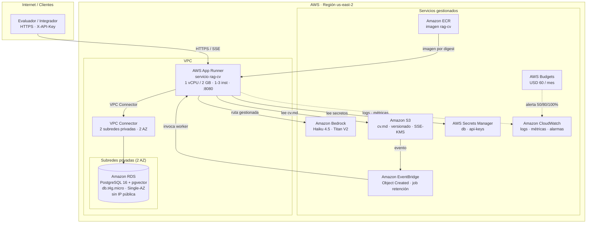

# Arquitectura de producción en AWS

Topología objetivo de PROD, región `us-east-2` (ADR-0005), desplegada con Terraform
(RFC-0007 §9). El cómputo es **AWS App Runner** desde **ECR**; la base de datos es
**RDS PostgreSQL + pgvector** privado; el CV vive en **S3** y los modelos en **Bedrock**.

## Inventario de recursos de producción

| Recurso | Configuración | Referencia |
| :--- | :--- | :--- |
| **Amazon ECR** | Repositorio `rag-cv`, escaneo activado, retención de 10 etiquetas | RFC-0007 §6.2 |
| **AWS App Runner** | 1 vCPU / 2 GB, puerto 8080, autoescalado 1–3, concurrencia 20 req/inst, health check `/readyz` | RFC-0007 §6.2 |
| **VPC Connector** | 2 subredes privadas en 2 AZ, `sg-apprunner-egress` | RFC-0007 §6.2 |
| **Amazon RDS** | PostgreSQL 16, `db.t4g.micro`, 20 GB gp3, Single-AZ, sin acceso público, cifrado KMS, backups 7 días | RFC-0007 §6.2 |
| **Amazon S3** | Bucket `cv.md`, versionado, SSE-KMS, eventos a EventBridge | README §Fuente del CV |
| **Amazon Bedrock** | Claude Haiku 4.5 (generación) + Titan Text Embeddings V2 (1024 dim) | ADR-0004, ADR-0005 |
| **AWS Secrets Manager** | `rag-cv/prod/db` y `rag-cv/prod/api-keys` | RFC-0007 §6.2 |
| **Amazon CloudWatch** | Logs 30 días, namespace `RagCV`, 10 alarmas | RFC-0010 §5–6 |
| **Amazon EventBridge** | Regla `Object Created` + trabajo de retención (30 días) | RFC-0007 §6.2, PRD §8 |
| **AWS Budgets** | Presupuesto USD 60 con alertas al 50/80/100 % | RFC-0007 §6.2 |

## Red y seguridad

- **Sin NAT Gateway.** App Runner sale a Bedrock y Secrets Manager por su ruta pública
  gestionada; solo el tráfico hacia la VPC pasa por el conector (ADR-0001, RFC-0007 §6.2).
- **Grupos de seguridad** por referencia, no por CIDR: `sg-rds` admite TCP 5432 únicamente
  desde `sg-apprunner-egress` (RFC-0007 §6.3).
- **IAM de mínimo privilegio:** el rol de instancia restringe `bedrock:InvokeModel` a los ARN
  de los dos modelos y del perfil de inferencia, sin `Resource: "*"` (RFC-0007 §7.1).
- **Cifrado:** S3 y RDS con KMS; secretos en Secrets Manager; TLS en el dominio de App Runner.

La contraparte de QA (VPS Ubuntu con `docker compose` + Caddy) está fuera de este diagrama y
se describe en RFC-0007 §5.
