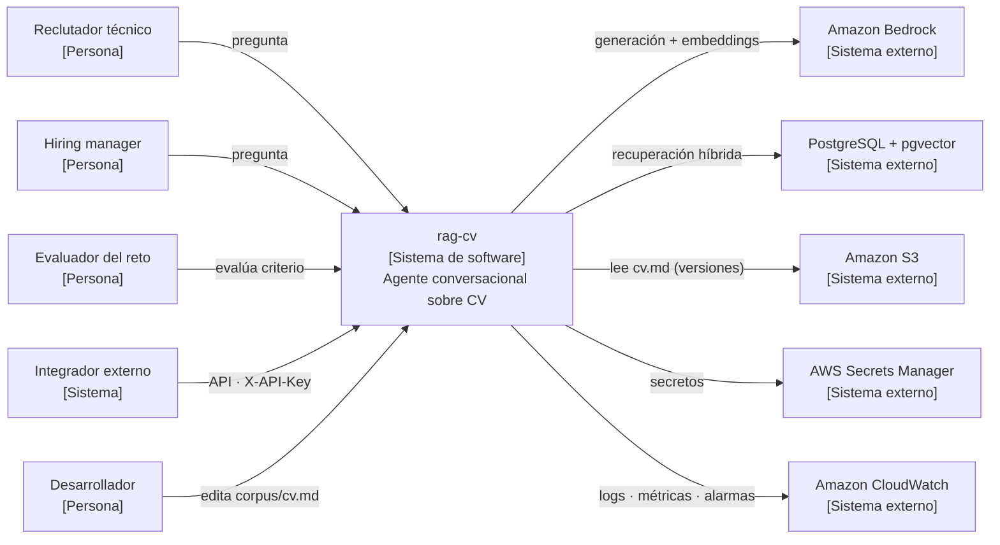
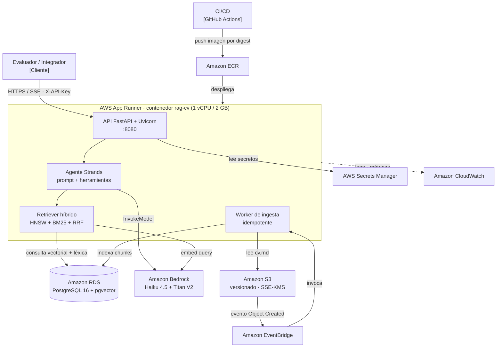
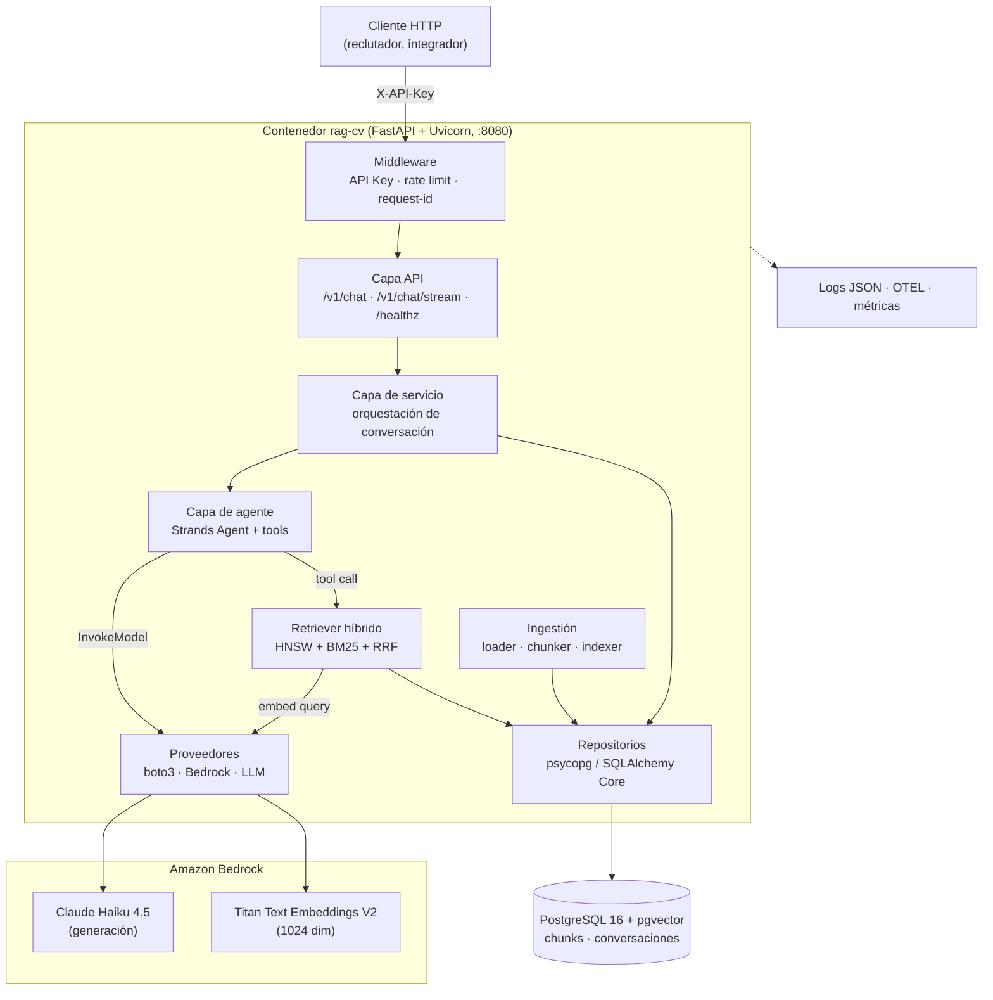

# Arquitectura C4 de `rag-cv`

Modelo C4 en tres niveles: **Contexto** (L1), **Contenedor** (L2) y **Componente** (L3).
El nivel de código (L4) se omite: el repositorio aún está en fase de planificación y no
existe la implementación Python. La estructura de paquetes de referencia está en
RFC-0001 §5.

## Nivel 1 — Contexto del sistema

## Nivel 2 — Contenedores

## Nivel 3 — Componentes (capas del contenedor)

## Reglas que los diagramas deben respetar

- Las dependencias apuntan hacia el centro: `api → services → agent → retrieval → db`.
  Ningún módulo interior importa uno exterior (RFC-0001 §4).
- El contenedor de App Runner **no** accede a RDS por internet: lo hace por el VPC Connector
  a subredes privadas (RFC-0007 §6).
- Bedrock es un sistema externo; el acceso se resuelve por rol IAM de instancia, sin claves
  de proveedor en producción (RFC-0007 §7.1).
