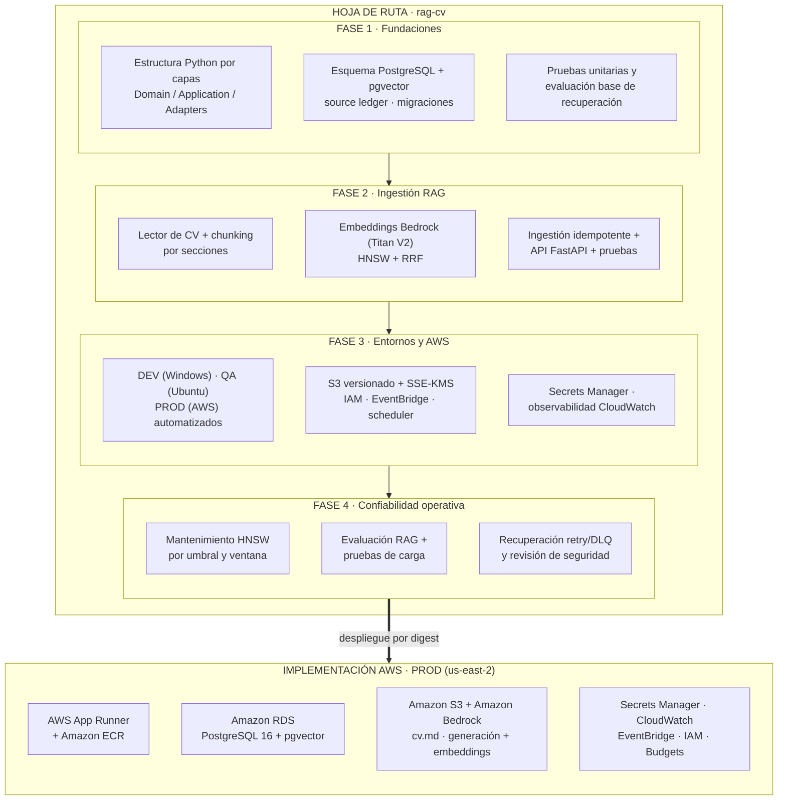

# Hoja de ruta: Fases 1–4 e implementación en AWS

Una sola vista que recorre la entrega del proyecto: la hoja de ruta en cuatro fases, qué
produce cada fase y el destino final, la implementación de producción en AWS.

## Lectura de la imagen

- **Fases 1 y 2** construyen el núcleo (capas, base de datos, ingesta RAG) sin depender de
  infraestructura específica de AWS: el código habla con puertos, no con servicios.
- **Fase 3** introduce los tres entornos y la infraestructura AWS (S3, IAM, EventBridge,
  secretos, observabilidad).
- **Fase 4** endurece la operación: mantenimiento de índices por umbral, evaluación de
  calidad y recuperación ante fallos.
- **AWS (PROD)** es el estado final: cómputo en App Runner desde ECR, datos en RDS privado,
  fuente del CV en S3 y modelos en Bedrock, todo con IAM de mínimo privilegio.

El detalle de cada fase está en [`README.md`](../../README.md#hoja-de-ruta) y la topología
completa de producción en [`arquitectura-aws.md`](arquitectura-aws.md).
