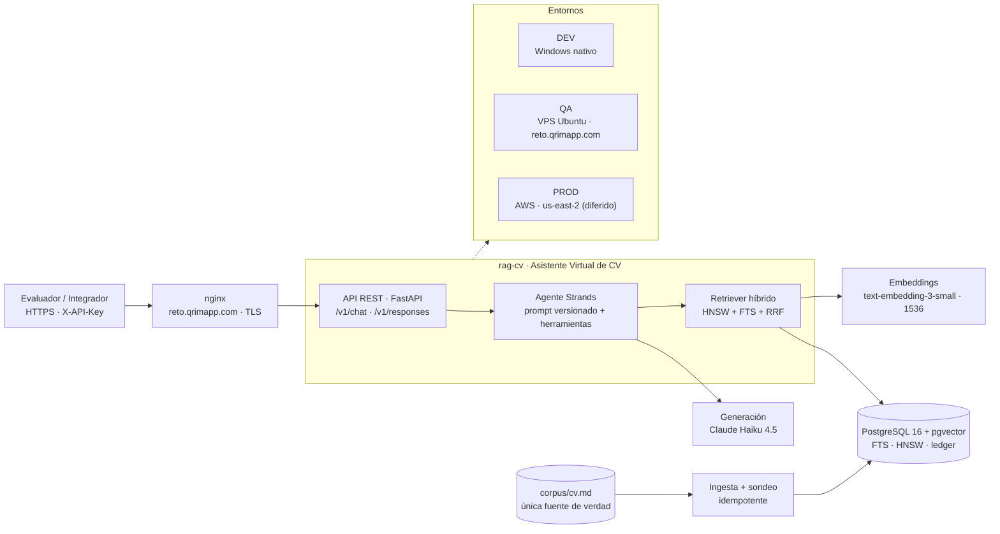

# Panorama de la arquitectura — `rag-cv`

Vista de una sola lámina: el flujo de una consulta, los datos, los modelos por configuración
y la topología de entornos (QA vigente, AWS diferido).

```mermaid
flowchart LR
    U["Evaluador / Integrador<br/>HTTPS · X-API-Key"] --> N["nginx<br/>reto.qrimapp.com · TLS"]

    subgraph APP["rag-cv · Asistente Virtual de CV"]
        direction TB
        API["API REST · FastAPI<br/>/v1/chat · /v1/responses"]
        AG["Agente Strands<br/>prompt versionado + herramientas"]
        RET["Retriever híbrido<br/>HNSW + FTS + RRF"]
    end

    N --> API --> AG --> RET

    AG --> GEN["Generación<br/>Claude Haiku 4.5"]
    RET --> EMB["Embeddings<br/>text-embedding-3-small · 1536"]

    RET --> DB[("PostgreSQL 16 + pgvector<br/>FTS · HNSW · ledger")]
    CV[("corpus/cv.md<br/>única fuente de verdad")] --> ING["Ingesta + sondeo<br/>idempotente"] --> DB

    subgraph ENTORNOS["Entornos"]
        direction LR
        DEV["DEV<br/>Windows nativo"]
        QA["QA<br/>VPS Ubuntu · reto.qrimapp.com"]
        PRD["PROD<br/>AWS · us-east-2 (diferido)"]
    end

    APP -.-> ENTORNOS
```
