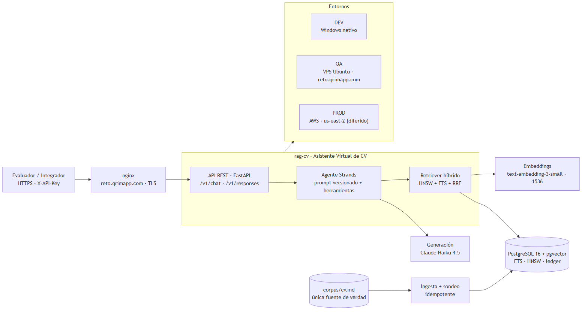
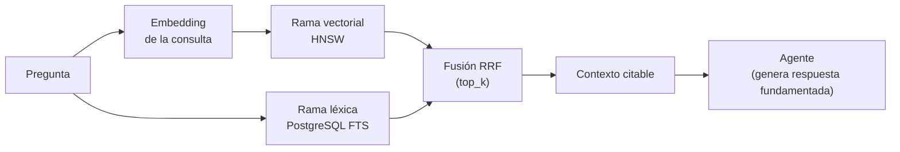
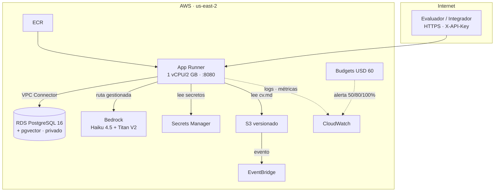

# RETO BANORTE — Presentación del proyecto

> Documento de soporte para la presentación del reto. La información técnica proviene del
> repositorio `rag-cv` (PRD, RFCs, ADRs y diagramas); los apartados que la documentación no
> cubre se completan para la narrativa de la presentación.

---

## 1. Pantalla de presentación

| Campo | Contenido |
| :--- | :--- |
| **Título** | Proyecto Asistente Virtual de Curriculum Vitae |
| **Subtítulo** | Reto Banorte para continuar con el proceso de selección para la vacante Full Stack AI Subdirección |
| **Área** | Gerencia de IA Generativa |
| **Repositorio** | `github.com/e2lira/rag-cv` |
| **Producto** | Agente conversacional accesible por API REST que responde sobre un CV, fundamentando cada respuesta en un corpus verificable y declarando cuándo no tiene información |

**Idea central de una frase:** no es "un chatbot con mi CV" — es demostrar criterio técnico en cómo se integra un modelo con contexto propio, se despliega, se opera y se verifica que responde de forma coherente y confiable.

---

## 2. Research: AWS (PROD) y VPS (QA)

Investigación previa que sostiene la decisión de entornos (respaldo en [`costos-aws.md`](costos-aws.md) y [`RFC-0007`](../rfc/RFC-0007-entornos-e-infraestructura.md)).

### 2.1 AWS — producción (`us-east-2`)

- **Región:** `us-east-2` (ADR-0005). Una sola región para cómputo, datos y modelos.
- **Presupuesto objetivo:** RNF-6 — costo total de PROD en reposo **≤ USD 60 / mes**.
- **Costo estimado:** ≈ USD 33–60/mes (mínimo ≈ 33–38, realista con ~1 000 turnos/mes ≈ 46–60).
- **Costo dominante:** el cómputo siempre encendido (App Runner + RDS), no la inferencia.

| Servicio | Configuración | Costo mensual |
| :--- | :--- | :--- |
| AWS App Runner | 1 vCPU / 2 GB, 1 instancia 24/7 | ≈ USD 10–13 |
| Amazon RDS | `db.t4g.micro`, Single-AZ, 20 GB gp3 | ≈ USD 14 |
| Amazon Bedrock | Claude Haiku 4.5 + Titan V2 | ≈ USD 5–15 |
| Amazon ECR | < 1 GB de imágenes | < USD 0.10 |
| AWS Secrets Manager | 2 secretos | USD 0.80 |
| Amazon CloudWatch | logs 30 días + métricas | ≈ USD 2–4 |
| Amazon S3 | `cv.md` versionado (KB) | < USD 0.10 |
| Amazon EventBridge | 2 reglas | < USD 0.10 |
| AWS Budgets | 1 presupuesto | USD 0 |

**Ahorros estructurales:** sin NAT Gateway (~USD 32), sin ALB (~USD 18), sin RDS Proxy (~USD 10), RDS Single-AZ `t4g.micro`, IAM restringido por ARN de modelo (no `Resource: "*"`).

### 2.2 VPS — QA (Hostinger)

- **Plataforma:** VPS Ubuntu Server 24.04 LTS, **2 núcleos / 8 GB de RAM**.
- **Propósito:** validar el artefacto y la conversación con datos reales a costo fijo bajo, y probar que la configuración es externa (portabilidad).
- **Topología:** procesos nativos, **sin contenedores** (ADR-0010); `nginx` ya instalado, PostgreSQL 16 + pgvector como servicio del sistema, la API como unidad `systemd` de usuario.
- **Dominio dedicado a la PoC:** `reto.qrimapp.com`, TLS emitido y renovado por el panel de Hostinger.
- **Costo:** fijo del VPS (no escala con el tráfico de inferencia).

---

## 3. Arquitectura

**Vista de una sola lámina** (para la presentación):



Fuente editable (Mermaid): [`reto-panorama.md`](reto-panorama.md).

### 3.1 Generación de RAG

Recuperación híbrida que combina **señal vectorial + señal léxica** y las fusiona con **RRF** (Reciprocal Rank Fusion) sobre PostgreSQL:



- `top_k` fragmentos devueltos con su identificador de sección (cita de fuentes en metadatos).
- Degradación a rama léxica si cae el proveedor de embeddings (`degraded=true`), sin tocar la generación.
- Embeddings por configuración (interfaz `Embedder`), nunca cableados (RNF-13).

### 3.2 Base de datos

**PostgreSQL 16 + pgvector + FTS + HNSW** en un solo motor:

| Capacidad | Mecanismo |
| :--- | :--- |
| Búsqueda semántica | `pgvector` con índice **HNSW** |
| Búsqueda léxica | **FTS** (`to_tsvector`/`to_tsquery`) |
| Metadatos y conversación | tablas relacionales (`cv_chunks`, `conversations`, `messages`) |
| Trazabilidad | `source_documents` ledger + `ingestion_jobs` |
| Migraciones | Alembic con `upgrade`/`downgrade` probados |
| Regionalización | base creada con proveedor ICU `es-MX` (acentos correctos en FTS) |

### 3.3 Cloud AWS — servicios de producción

| Servicio | Rol en el proyecto |
| :--- | :--- |
| **Amazon RDS** | PostgreSQL 16 + pgvector privado, `db.t4g.micro`, Single-AZ, sin IP pública, cifrado KMS |
| **Amazon Bedrock** | Claude Haiku 4.5 (generación) + Titan Text Embeddings V2 (1024 dim), por rol IAM sin claves |
| **Amazon ECR** | repositorio de la imagen `rag-cv`, escaneo activado, retención de 10 etiquetas |
| **Amazon S3** | `cv.md` versionado + SSE-KMS, eventos a EventBridge |
| **AWS Secrets Manager** | `rag-cv/prod/db` y `rag-cv/prod/api-keys` |
| **Amazon CloudWatch** | logs (30 días), métricas namespace `RagCV`, alarmas |
| **Amazon EventBridge** | regla `Object Created` + job de retención (30 días) |
| **AWS Budgets** | presupuesto USD 60 con alertas al 50/80/100 % |



> Nota de alcance: la PoC se entrega en **QA (VPS)**; el despliegue AWS es **diseño aprobado diferido** (ADR-0006), no cancelado.

---

## 4. Planeación del PoC

### 4.1 Stack de desarrollo

| Elemento | Elección | Nota |
| :--- | :--- | :--- |
| Lenguaje | **Python 3.12** | asyncio nativo |
| API | **FastAPI** + Uvicorn | validación por esquema, SSE |
| Agente | **Strands Agents SDK** (`strands-agents`) | herramientas por decorador, streaming, telemetría |
| AWS SDK | **boto3** (cliente Bedrock Runtime) | solo en el camino PROD diferido |
| Base de datos | PostgreSQL 16 + `pgvector` + driver `psycopg` (v3) | vector + léxico + transaccional |
| Migraciones | Alembic | versionado con `downgrade` |
| Tareas | `invoke` (`tasks.py`) | un solo comando para Windows, Ubuntu y CI |
| Dependencias | `uv` (pyproject + `uv.lock`) | reproducibilidad |

**Generación y embeddings (PoC vigente):** generación con **Claude Haiku 4.5** vía API de Anthropic (`claude-haiku-4-5-20251001`); embeddings con **`text-embedding-3-small`** de OpenAI (**1536 dim**). Ambos por configuración (`PROVEEDOR=anthropic`, `EMBEDDER=openai`).

### 4.2 VPS de servidor

Hostinger, Ubuntu 24.04, 2 núcleos / 8 GB, despliegue nativo por SSH (sin contenedores), dominio `reto.qrimapp.com`.

### 4.3 GitHub + Actions (CI/CD)

- Repositorio `e2lira/rag-cv`, **rama por RFC** (`feat/rfc-000N-<slug>`) y un PR por RFC.
- CI en **GitHub Actions** como autoridad de merge en Linux (`ubuntu-latest`) y job adicional en `windows-latest` para el camino inverso (código escrito en Windows).
- Pipeline: lint (`ruff`, `mypy --strict`, `import-linter`) → tests (unit + integration contra PostgreSQL real `pgvector/pgvector:pg16`) → despliegue a QA por SSH (RFC-0008).
- El CI en Linux es la **autoridad de merge**; DEV (Windows) valida el código, el CI valida el artefacto.

### 4.4 Patrones de diseño

| Patrón / Principio | Cómo se aplica |
| :--- | :--- |
| **Clean Architecture** | capas `Domain → Application → Adapters → Infrastructure`; las dependencias apuntan al centro; el núcleo no importa FastAPI, AWS SDK, ORM ni drivers |
| **SOLID** | desde el primer caso de uso; puertos e interfaces por capa; inyección de dependencias en el borde |
| **TDD primero (siempre)** | toda implementación empieza por su suite de tests **en rojo** (RFC-0014); el Auditor verifica revirtiendo código, no leyendo afirmaciones |

### 4.5 Lenguaje de programación y ecosistema

Python + **AWS SDK (boto3)** + **Strands Agents** + **FastAPI**, con generación/embeddings desacoplados por configuración (cambiar de modelo es configuración + ejecutar la suite de evaluación, nunca cambio de código).

---

## 5. Creación del software con IA Generativa

El software se construye con **ADU**, una metodología multiagente de tres roles con incentivos distintos, ejecutados por **tres modelos distintos**, de modo que el error de un rol tenga que sobrevivir a la revisión de otro modelo que no lo produjo.

| Rol | Modelo | Responsabilidad |
| :--- | :--- | :--- |
| **Arquitecto** | Claude Opus 5 | PRD, RFCs, ADRs, contratos, criterios de aceptación, resolución de discrepancias |
| **Desarrollador Senior** | Claude Sonnet 5 | Implementa un RFC aprobado bajo TDD estricto; rama + PR + commit de tests en rojo |
| **Auditor** | ChatGPT 5.6 Terra | Verifica el PR contra el contrato de auditoría del RFC; veredicto PASS / PASS-CON-OBSERVACIONES / FAIL |

**Regla del método:** lo que se audita nunca es el código — es el código *contra el RFC*. El rol que audita **no comparte modelo ni proveedor** con el que implementa (ChatGPT 5.6 Terra es de un proveedor distinto a Claude).

Flujo con gates:

```
Necesidad ─G0→ PRD ─G1→ RFC ─G2→ Implementación ─G3→ Auditoría ─G4→ Merge ─G5→ QA ─G6→ PROD
```

**Generación de PRD y RFC:** el Arquitecto (Claude Opus 5) produce el **[PRD](../PRD.md)** (producto, usuarios, casos de uso, requisitos funcionales/no funcionales, métricas de éxito) y los **RFCs** con contrato de auditoría cerrado. Cada RFC cubre un componente completo con Definition of Ready / Definition of Done verificables.

---

## 6. Las 6 fases del proyecto RAG-CV (y sus RFCs)

Orden de ejecución real según [`PLAN-DE-EJECUCION.md`](../PLAN-DE-EJECUCION.md), con la fase de AWS diferida como sexta.

### Fase 0 — Fundaciones · *hacer posible el TDD*

| RFC | Entrega |
| :--- | :--- |
| **RFC-0011** Entorno DEV Windows nativo | Python 3.12, PostgreSQL 16 + pgvector nativo, bootstrap idempotente, tareas `invoke` |
| **RFC-0006** Modelo de datos y migraciones | extensiones, DDL, índices, restricciones, migraciones Alembic, `VECTOR(1536)` |
| **RFC-0021** Arranque validado | `lifespan` con las comprobaciones de arranque; la app no arranca sin BD |
| **RFC-0014** Disciplina TDD | transversal a todo el proyecto: commit en rojo, test → implementación |

### Fase 1 — Ingesta · *el CV indexado y vigilándose solo*

| RFC | Entrega |
| :--- | :--- |
| **RFC-0012 + RFC-0017** Embeddings | interfaz `Embedder`, fábrica, `OpenAIEmbedder` (`text-embedding-3-small`, 1536 dim) |
| **RFC-0002** Ingesta y chunking | formato del corpus, troceado por `##`, indexación idempotente, CLI |
| **RFC-0019** Sondeo del corpus | detección de cambios, *lease*, promoción a `is_current`, latido |

### Fase 2 — Respuestas · *el agente contesta*

| RFC | Entrega |
| :--- | :--- |
| **RFC-0003** Recuperación híbrida | HNSW + PostgreSQL FTS + RRF, degradación a rama léxica |
| **RFC-0013 + RFC-0018** Proveedores LLM | fábrica `build_model`, `PROVEEDOR=anthropic` con `claude-haiku-4-5` |
| **RFC-0004** Capa de agente Strands | prompt de sistema versionado, herramienta de recuperación |
| **RFC-0005** API REST y autenticación | contrato HTTP, API Key, rate limit, `/healthz`/`/readyz`, `/v1/responses` |

### Fase 3 — Calidad · *el gate que decide si funciona*

| RFC | Entrega |
| :--- | :--- |
| **RFC-0009** Evaluación y guardrails | conjunto dorado, métricas, umbrales de merge, suite adversarial, calibración del juez |

### Fase 4 — Entrega en QA

| RFC | Entrega |
| :--- | :--- |
| **RFC-0020** Topología nativa de QA | nginx, unidad `systemd` de usuario, despliegue `rsync` + enlace `current`, reversión, endurecimiento |
| **RFC-0008** CI/CD | pipeline de calidad, construcción y despliegue hasta QA |
| **RFC-0010** Observabilidad | logs JSON con rotación, métricas, alertas, runbook |

### Fase 5 — PROD en AWS (diferida)

| RFC | Entrega (diseño aprobado, ejecución pospuesta por ADR-0006) |
| :--- | :--- |
| **RFC-0007** Entornos e infraestructura | topología PROD en AWS, IAM, Terraform, costos |
| **RFC-0015** Empaquetado Docker | imagen `python:3.12-slim` promovida QA → PROD por digest |

> **Diferido no es obsoleto:** ninguno de estos documentos se edita; recuperan vigencia al cerrar ADR-0006.

---

## 7. Puesta a punto del VPS

Aprovisionamiento e instalación del entorno QA (contrato en [`RFC-0020`](../rfc/RFC-0020-topologia-nativa-de-qa-y-despliegue-por-ssh.md)).

### 7.1 Componentes instalados y configurados

| Componente | Configuración |
| :--- | :--- |
| **Base de datos PostgreSQL** | PostgreSQL 16 + `pgvector` como servicio del sistema, `listen_addresses = 'localhost'`, base `ragcv` creada con ICU `es-MX` |
| **Nginx** | proxy inverso ya instalado; `proxy_pass` a `127.0.0.1:8080`; TLS del dominio; `proxy_buffering off` en el *stream* SSE |
| **Servidor virtual** | VPS Ubuntu 24.04, procesos nativos sin contenedores; la API como unidad `systemd` de usuario (`rag-cv-api.service`) |
| **Dominio** | `reto.qrimapp.com`, dedicado a la PoC, certificado emitido y renovado por el panel de Hostinger |

### 7.2 Pasos clave del aprovisionamiento

1. Instalar `postgresql-16`, `postgresql-16-pgvector` y `python3.12-venv` (nginx ya está sirviendo: no se toca ni se instala Caddy).
2. Crear la base con proveedor ICU `es-MX` **antes** de la primera migración.
3. Verificar el cortafuegos (`ufw`) sin abrir el puerto 5432.
4. `loginctl enable-linger qrimapp-reto` para que el servicio sobreviva a reinicios.
5. Crear el árbol `/opt/rag-cv/{releases,corpus,logs}` propiedad del operador.
6. Desplegar por SSH: `rsync` (excluyendo `.env` y `corpus/`) → `venv` → `alembic upgrade head` → conmutación atómica del enlace `current` → `systemctl --user restart rag-cv-api` → `curl /readyz`.
7. Endurecer la unidad (`ProtectHome=yes`, `NoNewPrivileges=yes`, `ProtectSystem=strict`, `MemoryMax`, `CPUWeight`).
8. Instalar el `cron` del sondeo del corpus y la rotación de bitácoras.

### 7.3 Resultado

El agente responde sobre el CV en `https://reto.qrimapp.com`, fundamentado y citando fragmentos; se abstiene correctamente cuando la respuesta no está en el corpus; actualizar `cv.md` reindexa solo; la suite de evaluación corre contra QA y publica sus métricas.

---

## Referencias

- [`docs/PRD.md`](../PRD.md) — producto, requisitos y casos de uso.
- [`docs/PLAN-DE-EJECUCION.md`](../PLAN-DE-EJECUCION.md) — orden de implementación y fases.
- [`docs/adu/ADU-PROCESO.md`](../adu/ADU-PROCESO.md) — método multiagente ADU.
- [`docs/rfc/RFC-0001`](../rfc/RFC-0001-arquitectura-general.md) — arquitectura, capas e invariantes.
- [`docs/rfc/RFC-0007`](../rfc/RFC-0007-entornos-e-infraestructura.md) — entornos, IAM y costos.
- [`docs/rfc/RFC-0016`](../rfc/RFC-0016-alcance-poc-y-entrega-en-qa.md) — alcance vigente de la PoC.
- [`docs/rfc/RFC-0020`](../rfc/RFC-0020-topologia-nativa-de-qa-y-despliegue-por-ssh.md) — topología nativa de QA.
- [`docs/diagramas/`](.) — arquitectura C4, AWS y costos.
