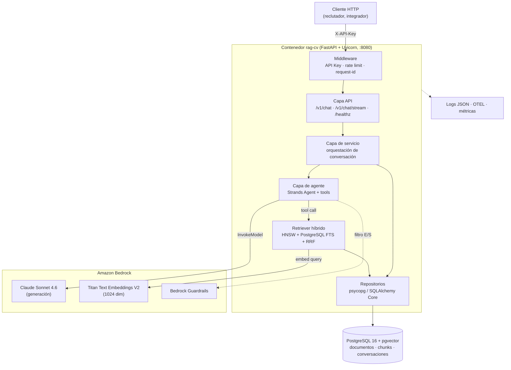

# RFC-0001 — Arquitectura general y límites del sistema

| Campo | Valor |
| :--- | :--- |
| **Estado** | Aprobado |
| **Autor** | Arquitecto (Claude Opus 5) |
| **Depende de** | — |
| **ADRs** | ADR-0001, ADR-0002, ADR-0003 |
| **Fecha** | 2026-08-22 |

---

## 1. Contexto y problema

El PRD pide un agente conversacional que responda sobre una trayectoria profesional **sin
inventar**, accesible por API, desplegable en tres entornos con la misma imagen, y verificable
de forma automatizada. Este RFC fija la descomposición del sistema, los límites entre capas y
las invariantes que el resto de RFCs no pueden romper.

## 2. Alcance

**Entra:** descomposición en capas, contratos entre capas, estructura del repositorio,
configuración, presupuesto de latencia y las invariantes transversales.

**No entra:** el detalle de cada capa (RFCs 0002–0010), el diseño de la infraestructura
concreta de cada entorno (RFC-0007) ni el pipeline (RFC-0008).

## 3. Vista de componentes



## 4. Capas y responsabilidades

| Capa | Módulo | Responsabilidad | Prohibido |
| :--- | :--- | :--- | :--- |
| **API** | `app/api/` | Validación de esquemas, códigos HTTP, SSE, cabeceras | Contener lógica de negocio o SQL |
| **Servicio** | `app/services/` | Orquestar turno de conversación, memoria, persistencia del turno | Construir prompts de modelo o SQL crudo |
| **Agente** | `app/agent/` | Prompt de sistema, registro de herramientas, política de razonamiento | Conocer FastAPI o el esquema HTTP |
| **Retrieval** | `app/retrieval/` | Embedding de la consulta, búsqueda híbrida, fusión RRF, formateo del contexto | Llamar al LLM de generación |
| **Datos** | `app/db/` | Conexiones, pool, consultas, migraciones | Contener reglas de negocio |
| **Infra AWS** | `app/providers/` | Clientes boto3, reintentos, mapeo de errores de Bedrock | Ser importado por la capa API |
| **Configuración** | `app/core/config.py` | Única lectura de variables de entorno del proceso | Leerse `os.environ` en cualquier otro sitio |

**Regla de dependencia:** las flechas de import apuntan siempre hacia adentro
(`api → services → agent → retrieval → db`). Ningún módulo interior importa uno exterior.
Esto es lo que permite probar el agente y el retriever sin levantar HTTP.

## 5. Estructura del repositorio

```text
rag-cv/
├── app/
│   ├── main.py                  # factory de FastAPI, lifespan, routers
│   ├── dev_server.py            # lanzador de DEV (Windows): fija el event loop y arranca uvicorn
│   ├── core/
│   │   ├── config.py            # Settings (pydantic-settings) — única fuente de env
│   │   ├── platform.py          # diferencias de SO: política de event loop, rutas
│   │   ├── logging.py           # structlog en JSON, request-id, redacción
│   │   ├── security.py          # verificación de API Key, roles, rate limit
│   │   └── errors.py            # excepciones de dominio -> respuestas HTTP
│   ├── api/
│   │   ├── deps.py              # dependencias FastAPI (auth, sesión de BD)
│   │   └── v1/
│   │       ├── chat.py          # POST /v1/chat, POST /v1/chat/stream
│   │       ├── health.py        # GET /healthz, GET /readyz
│   │       └── admin.py         # POST /v1/admin/reindex
│   ├── services/
│   │   └── conversation.py      # orquestación del turno + memoria
│   ├── agent/
│   │   ├── builder.py           # construcción del Strands Agent
│   │   ├── prompts.py           # prompt de sistema versionado
│   │   └── tools/
│   │       ├── search_cv.py     # herramienta de recuperación híbrida
│   │       └── list_sections.py # herramienta de índice del corpus
│   ├── retrieval/
│   │   ├── embedder.py          # interfaz Embedder + implementaciones + fábrica (RFC-0012)
│   │   ├── hybrid.py            # SQL de búsqueda híbrida + RRF
│   │   └── formatter.py         # contexto -> bloque citable
│   ├── ingestion/
│   │   ├── loader.py            # lectura del corpus Markdown
│   │   ├── chunker.py           # troceado por secciones + metadatos
│   │   └── indexer.py           # upsert idempotente por hash
│   ├── db/
│   │   ├── engine.py            # pool, health, tipos vector
│   │   └── repositories/
│   └── providers/
│       ├── llm.py               # fábrica del proveedor de generación (RFC-0013)
│       └── bedrock.py           # cliente boto3, reintentos, timeouts
├── corpus/
│   └── cv.md                    # fuente de verdad del CV
├── migrations/                  # Alembic
├── evals/
│   ├── golden_set.yaml          # preguntas de referencia
│   └── run_eval.py
├── tests/
│   ├── fakes/                   # FakeEmbedder, FakeModel, ephemeral_db, frozen_clock
│   └── {unit,integration,adversarial}/
├── infra/
│   ├── terraform/               # PROD (AWS)
│   ├── compose/                 # QA (VPS Ubuntu)
│   └── vps/bootstrap.sh         # aprovisionamiento del VPS de QA
├── scripts/
│   └── bootstrap-dev.ps1        # puesta en marcha de DEV en Windows (RFC-0011)
├── docs/
├── tasks.py                     # tareas multiplataforma (invoke): lint, test, index, dev
├── Dockerfile
├── pyproject.toml
├── uv.lock
├── .gitattributes               # finales de línea: LF forzado en *.sh y Dockerfile
└── .env.example
```

## 6. Stack fijado

| Elemento | Elección | Versión mínima | Razón |
| :--- | :--- | :--- | :--- |
| Lenguaje | Python | 3.12 | Rendimiento de asyncio y soporte de dependencias |
| API | FastAPI + Uvicorn | 0.115 / 0.34 | Async nativo, validación por esquema, SSE simple |
| Agente | `strands-agents` | 1.52 | Herramientas por decorador, streaming, telemetría, credenciales por rol IAM |
| SDK AWS | `boto3` | 1.35 | Cliente de Bedrock Runtime |
| Base de datos | PostgreSQL + `pgvector` | 16 / 0.8 | Vector + léxico + transaccional en un solo motor |
| Driver | `psycopg` (v3) + pool | 3.2 | Soporte async y binario, `pgvector-python` |
| Migraciones | Alembic | 1.13 | Versionado de esquema con `downgrade` |
| Generación | Proveedor designado por `PROVEEDOR` (RFC-0013) | — | Bedrock / Anthropic / compatible con OpenAI. Inicial: Claude Haiku 4.5 sobre Bedrock |
| Embeddings | `amazon.titan-embed-text-v2:0` vía Bedrock (RFC-0012) | — | **1024 dim**, multilingüe, misma credencial y región que la generación |
| Contenedor | Docker (imagen `python:3.12-slim`) | — | Misma imagen en QA y PROD; DEV corre nativo |
| Bucle de eventos | `uvloop` en Linux; `asyncio` + `WindowsSelectorEventLoopPolicy` en Windows | — | psycopg async no admite `ProactorEventLoop` (RFC-0011 §5.1) |
| Tareas | `invoke` (`tasks.py`) | 2.2 | Un solo conjunto de comandos para Windows, Ubuntu y CI |

**Entornos:** el desarrollo es **Windows nativo** (Python, PostgreSQL y pgvector instalados en
el sistema, sin Docker), QA es **Ubuntu** y PROD es **AWS**. El salto de sistema operativo entre
donde se escribe el código y donde se ejecuta tiene consecuencias concretas sobre este stack
—el bucle de eventos de psycopg, la compilación de pgvector, la configuración regional de
PostgreSQL, los finales de línea— que se tratan en RFC-0011 y se contienen en el pipeline
(RFC-0008 §4.1).

> **Corrección respecto al documento base (`conversacion_aws_bedrock.md`):** ese documento
> declara `VECTOR(1536)` para Titan V2. 1536 corresponde a **Titan Embeddings G1 (v1)**; Titan
> Text Embeddings **V2** produce **1024** dimensiones (configurable a 512 o 256). El esquema usa
> `VECTOR(1024)` y la petición fija `dimensions: 1024, normalize: true`. El resto de correcciones
> están en RFC-0003 §10 y RFC-0004 §13.

## 7. Flujo de un turno

1. `POST /v1/chat` con `X-API-Key`. El middleware autentica, aplica cuota y asigna `request_id`.
2. La capa de servicio recupera los últimos *N* turnos de la conversación (memoria acotada).
3. El agente recibe pregunta + historial y decide si invoca `search_cv`.
4. `search_cv` embebe la consulta (Titan V2), ejecuta la búsqueda híbrida en PostgreSQL,
   fusiona con RRF y devuelve los `top_k` fragmentos con su identificador de sección.
5. El agente genera la respuesta fundamentada en esos fragmentos (Claude Sonnet 4.6).
6. La capa de servicio persiste el turno (pregunta, respuesta, fragmentos usados, tokens, costo)
   y responde con la carga útil y los metadatos de fuentes.

## 8. Presupuesto de latencia (p95, respuesta corta)

| Tramo | Presupuesto | Nota |
| :--- | :--- | :--- |
| Middleware (auth + cuota) | 5 ms | Verificación de hash en memoria |
| Carga de memoria de conversación | 15 ms | Índice por `conversation_id` |
| Embedding de la consulta (Titan V2) | 120 ms | Una sola llamada |
| Búsqueda híbrida en PostgreSQL | 60 ms | HNSW con `ef_search=40` sobre corpus pequeño |
| Razonamiento + generación (Bedrock) | 1 500 ms hasta el primer token | Dominante |
| Persistencia del turno | 20 ms | Fuera de la ruta crítica (tarea en segundo plano) |
| **Total hasta primer token** | **~1.7 s** | Margen sobre RNF-1 (2.0 s) |

Si el agente encadena dos llamadas a herramientas, el presupuesto se duplica en el tramo de
recuperación. El prompt de sistema lo desincentiva explícitamente (RFC-0004 §4).

## 9. Configuración (contrato de variables de entorno)

| Variable | Ejemplo | Obligatoria | Descripción |
| :--- | :--- | :--- | :--- |
| `APP_ENV` | `dev` \| `qa` \| `prod` | Sí | Selecciona valores por defecto y nivel de log |
| `LOG_LEVEL` | `INFO` | No | `DEBUG` prohibido en PROD |
| `DATABASE_URL` | `postgresql://…` | Sí | En PROD se resuelve desde Secrets Manager al arrancar |
| `AWS_REGION` | `us-east-2` | Sí | Región de Bedrock (generación y embeddings) y de RDS |
| `PROVEEDOR` | `bedrock` | Sí | Proveedor de generación (RFC-0013). El resto de variables depende de esta rama |
| `EMBEDDER` | `titan` | Sí | Implementación de embeddings (RFC-0012) |
| `TITAN_MODEL_ID` | `amazon.titan-embed-text-v2:0` | Sí (`EMBEDDER=titan`) | Modelo de embeddings |
| `EMBEDDING_DIM` | `1024` | Sí | Debe coincidir con el embedder y con el DDL; se valida al arrancar |
| `RETRIEVAL_TOP_K` | `5` | No | Fragmentos devueltos al agente |
| `RETRIEVAL_CANDIDATES` | `20` | No | Candidatos por rama antes de RRF |
| `RRF_K` | `60` | No | Constante de Reciprocal Rank Fusion |
| `CONVERSATION_MEMORY_TURNS` | `6` | No | Turnos de historial enviados al modelo |
| `API_KEYS_SECRET_ID` | `rag-cv/prod/api-keys` | Sí (QA/PROD) | Secreto con los hashes de API Key |
| `RATE_LIMIT_PER_MINUTE` | `30` | No | Cuota por clave |
| `BEDROCK_GUARDRAIL_ID` | `gr-xxxx` | No | Si está vacío, guardrails desactivados |
| `CORPUS_PATH` | `corpus/cv.md` | No | Ruta del corpus para la reindexación |
| `OTEL_EXPORTER_OTLP_ENDPOINT` | — | No | Trazas; vacío = solo logs |

El detalle completo de las variables por rama está en RFC-0013 §4 (generación) y RFC-0012 §6
(embeddings). `Settings` valida **por rama**: si falta una variable de la rama activa, el proceso
no arranca.

Se leen **una sola vez**, en `app/core/config.py`, mediante `pydantic-settings`. Un valor
faltante u obligatorio inválido hace fallar el arranque (*fail fast*), nunca en la primera
petición.

## 10. Invariantes del sistema

| # | Invariante | Por qué |
| :--- | :--- | :--- |
| I-1 | Ninguna afirmación factual de la respuesta procede de conocimiento paramétrico del modelo | Es el requisito central de confiabilidad (RF-2) |
| I-2 | El contenido recuperado entra al prompt **delimitado y etiquetado como datos**, nunca como instrucciones | Defensa ante inyección de prompt |
| I-3 | `EMBEDDING_DIM` coincide con la dimensión de la columna `vector` | Un desajuste degrada la búsqueda silenciosamente |
| I-4 | La base de datos no es accesible desde internet en QA ni en PROD | RNF-7 |
| I-5 | La misma imagen (mismo *digest*) construida en el CI se promueve QA → PROD, sin reconstruir | Reproducibilidad (RNF-10) |
| I-5b | Ninguna decisión de código depende del sistema operativo fuera de `app/core/platform.py` | Contiene el salto Windows → Linux en un solo módulo |
| I-6 | Ninguna respuesta de error expone SQL, trazas ni nombres de recursos internos | Superficie de ataque |
| I-7 | La reindexación es idempotente y no bloquea las lecturas | CU-6 |
| I-8 | Todo cambio de prompt de sistema o de modelo pasa por la suite de evaluación | Deriva de comportamiento |
| I-9 | Ningún módulo fuera de `app/providers/llm.py` y `app/retrieval/embedder.py` nombra un proveedor concreto | Cambiar de modelo es configuración, no código (RNF-13) |
| I-10 | Todo código de producción nace de un test que falló primero | TDD verificable (RFC-0014) |

## 11. Fallos y degradación

| Fallo | Detección | Comportamiento |
| :--- | :--- | :--- |
| Bedrock `ThrottlingException` | Excepción de boto3 | Reintento exponencial (3 intentos, *jitter*); si persiste → HTTP 503 con `retry_after` |
| Bedrock no disponible | Timeout 30 s | HTTP 503, sin respuesta inventada |
| PostgreSQL caído | Fallo del pool | `/readyz` en rojo; `/v1/chat` → 503; el agente **no** responde sin contexto |
| Recuperación vacía | 0 fragmentos tras RRF | El agente responde "no consta en mi información" (RF-4), HTTP 200 |
| API Key inválida | Middleware | HTTP 401, cuerpo genérico, sin distinguir "inexistente" de "revocada" |
| Cuota excedida | Contador por clave | HTTP 429 con `Retry-After` |
| Corpus no indexado al arrancar | `count(chunks) = 0` | `/readyz` en rojo hasta que la indexación termine |

## 12. Criterios de aceptación

| # | Criterio | Verificación |
| :--- | :--- | :--- |
| CA-1 | La estructura de paquetes coincide con §5 | `pytest tests/unit/test_architecture.py` (comprueba existencia de módulos) |
| CA-2 | Se respeta la regla de dependencia de §4 | `import-linter` con contrato de capas en CI |
| CA-3 | El arranque falla si falta una variable obligatoria | `pytest tests/unit/test_config.py::test_missing_required_env_fails` |
| CA-4 | El arranque falla si `EMBEDDING_DIM` ≠ dimensión de la columna | `pytest tests/integration/test_startup_checks.py` |
| CA-5 | `os.environ` no se lee fuera de `app/core/config.py` | `grep -rn "os.environ" app/ | grep -v core/config.py` sin resultados |
| CA-6 | `/healthz` responde sin tocar la base de datos; `/readyz` sí la toca | `pytest tests/integration/test_health.py` |
| CA-7 | Las diferencias de sistema operativo viven solo en `app/core/platform.py` | `grep -rn "sys.platform\|os.name" app/ | grep -v core/platform.py` sin resultados |

## 13. Riesgos

| Riesgo | Mitigación |
| :--- | :--- |
| La capa de servicio se convierte en un cajón de sastre | El Auditor comprueba la regla de dependencia (CA-2) en cada PR |
| Acoplamiento a la API de Strands | Todo uso de Strands vive en `app/agent/`; el resto habla con una interfaz propia |
| Sobreingeniería para un corpus pequeño | El alcance no incluye reranker ni caché; se activan solo si una métrica lo exige |

## Contrato de auditoría (gate ADU)

| # | Comprobación | Cómo se verifica | Severidad si falla |
| :--- | :--- | :--- | :--- |
| A-1 | Existen los paquetes de §5 y ninguno vacío sin `__init__.py` | Inspección del árbol + CA-1 | Menor |
| A-2 | `import-linter` pasa con el contrato de capas | Ejecutar `lint-imports` | Mayor |
| A-3 | No hay lectura de `os.environ` fuera de `core/config.py` | CA-5 | Mayor |
| A-4 | Toda variable de §9 marcada obligatoria está declarada en `Settings` sin valor por defecto | Lectura de `config.py` | Bloqueante |
| A-5 | `.env.example` lista exactamente las variables de §9 | Comparación literal | Menor |
| A-6 | Los manejadores de error no exponen trazas ni SQL (I-6) | Provocar 500 en pruebas y revisar el cuerpo | Bloqueante |
| A-7 | La dimensión de embeddings es 1024 en DDL, en configuración y en la llamada a Titan | Búsqueda de `1536` en el repo: 0 resultados en código | Bloqueante |
| A-8 | El presupuesto de latencia de §8 está instrumentado con métricas por tramo | Revisar spans/métricas emitidas | Menor |
| A-9 | No hay ramas por sistema operativo fuera de `core/platform.py` | CA-7 | Mayor |
| A-10 | Existen `tasks.py`, `.gitattributes` y `scripts/bootstrap-dev.ps1` | Inspección del árbol | Menor |
