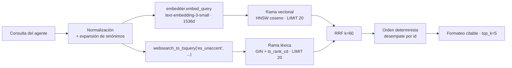

# RFC-0003 — Recuperación híbrida: HNSW + PostgreSQL FTS + Reciprocal Rank Fusion

| Campo | Valor |
| :--- | :--- |
| **Estado** | Aprobado |
| **Depende de** | RFC-0002, RFC-0006, RFC-0012, RFC-0017 |
| **ADRs** | ADR-0002 |
| **Fecha** | 2026-08-22 |

---

## 1. Contexto y problema

Las dos familias de recuperación fallan en sentidos opuestos sobre un CV:

- **Solo vectorial:** falla en consultas con entidades exactas. *"¿Trabajó en Banorte?"* o
  *"¿Sabe Terraform?"* son preguntas donde el token literal importa más que la semántica, y un
  embedding denso sobre un corpus pequeño produce vecinos plausibles pero
  equivocados (todas las experiencias se parecen entre sí).
- **Solo léxica:** falla en consultas parafraseadas. *"¿tiene experiencia liderando gente?"*
  no comparte ningún término con *"responsable de un equipo de 6 personas"*.

Un CV recibe ambos tipos de pregunta en la misma conversación. Este RFC define la recuperación
híbrida y su fusión.

## 2. Alcance

**Entra:** embebido de la consulta, rama vectorial, rama léxica, fusión RRF, ordenamiento
determinista, formateo del contexto y contrato de la herramienta.

**No entra:** el DDL y los índices (RFC-0006), la decisión del agente sobre *cuándo* buscar
(RFC-0004), reranking con modelo dedicado (deuda declarada, §9).

## 3. Diseño de la consulta



> **Modificado por RFC-0012 y RFC-0017.** La rama vectorial usa **`embedder.embed_query(...)`**,
> nunca `embed_documents`. `text-embedding-3-small` es simétrico y hoy ambos métodos hacen lo
> mismo, pero un modelo asimétrico no lo sería: usar el lado equivocado degradaría la
> recuperación **sin producir ningún error**. Respetar la distinción ahora es lo que hace que
> cambiar de modelo sea barato. El vector tiene **1536 dimensiones**.
>
> La versión anterior de este párrafo decía «Titan V2 · 1024d». ADR-0007 sustituyó Titan por
> OpenAI y RFC-0017 §4 fijó 1536; `titan` está en `_DEFERRED` y `build_embedder` lanza
> `DeferredEmbedderError` si alguien lo pide. El esquema desplegado declara `VECTOR(1536)`.

### 3.1 Normalización de la consulta

1. Recorte y colapso de espacios; se conservan mayúsculas para el embedding.
2. Para la rama léxica: `unaccent` + minúsculas (el usuario escribe "banorte", el corpus dice
   "Banorte"; el español acentuado hace imprescindible `unaccent`).
3. **Expansión de sinónimos** sobre el diccionario compartido de RFC-0002 §5: la consulta léxica
   `k8s` se convierte en `k8s | kubernetes`. La consulta vectorial **no** se expande: el
   embedding ya captura la relación y la expansión introduce ruido.

   `app/ingestion/synonyms.py` entrega hoy `SYNONYMS: dict[str, str]` y `normalize_tech_tag`,
   que es una canonicalización **1 a 1** (`k8s` → `kubernetes`), no una expansión. Convertirla
   en `k8s | kubernetes` exige una función nueva —invertir el mapa y unir el término con todos
   sus alias— y **entra en el alcance de este RFC**. Reutilizar el diccionario no significa que
   la expansión ya exista: la lista de sinónimos sigue viviendo en un único módulo (RFC-0002
   A-7), y lo que se añade es cómo se consulta.

### 3.2 Rama vectorial

```sql
SELECT id, ROW_NUMBER() OVER (ORDER BY embedding <=> %(qv)s::vector, id) AS rank
FROM cv_chunks
WHERE doc_id = %(doc_id)s
ORDER BY embedding <=> %(qv)s::vector, id
LIMIT %(candidates)s;
```

`SET LOCAL hnsw.ef_search = 40;` antes de la consulta: con ~60–200 fragmentos, 40 da recall
prácticamente perfecto a coste despreciable. El valor es configurable por
`RETRIEVAL_EF_SEARCH`.

### 3.3 Rama léxica

```sql
SELECT id, ROW_NUMBER() OVER (ORDER BY ts_rank_cd(tsv, query) DESC, id) AS rank
FROM cv_chunks, websearch_to_tsquery('public.es_unaccent', %(q)s) AS query
WHERE doc_id = %(doc_id)s AND tsv @@ query
ORDER BY ts_rank_cd(tsv, query) DESC, id
LIMIT %(candidates)s;
```

Se usa `websearch_to_tsquery` en lugar de `plainto_tsquery`: tolera comillas y operadores que
un usuario escribe de forma natural, y no falla ante una consulta con signos de puntuación.
El `tsv` se genera con `unaccent` en el trigger (RFC-0006 §4), de modo que la consulta también
se desacentúa antes de construir el `tsquery`.

### 3.4 Fusión RRF

```sql
WITH semantic AS ( ... ), lexical AS ( ... ),
fused AS (
  SELECT COALESCE(s.id, l.id) AS id,
         COALESCE(1.0 / (%(rrf_k)s + s.rank), 0.0) * %(w_sem)s
       + COALESCE(1.0 / (%(rrf_k)s + l.rank), 0.0) * %(w_lex)s AS score,
         s.rank AS sem_rank, l.rank AS lex_rank
  FROM semantic s FULL OUTER JOIN lexical l ON s.id = l.id
)
SELECT c.id, c.doc_id, c.section, c.unit, c.chunk_type, c.part, c.parts,
       c.content, c.date_start, c.date_end, c.tech_tags,
       f.score, f.sem_rank, f.lex_rank
FROM fused f JOIN cv_chunks c ON c.id = f.id
ORDER BY f.score DESC, c.id
LIMIT %(top_k)s;
```

**Las dos ramas y la carga final van en UNA sola sentencia, y eso es normativo (A-4).** No es
estilo: una sentencia lee de un único *snapshot*, así que ninguna reindexación puede intercalarse
entre las ramas. Partirla en tres consultas —lo primero que se le ocurre a cualquiera que quiera
paralelizar las ramas— abre exactamente la ventana que este RFC no puede permitirse: la rama
vectorial leyendo el corpus viejo y la léxica el nuevo, fusionados como si fueran el mismo. El
resultado no sería un error, sería una respuesta plausible sobre dos CV distintos.

`SET LOCAL hnsw.ef_search` sí es una sentencia aparte, y no rompe nada: no lee datos. Lo que la
condición exige es que **la lectura** sea una sola.

> **Por qué la vista `rag_cv.active_chunks` desapareció de aquí.** La versión anterior consultaba
> esa vista, que no existe: `rg active_chunks` no la encuentra en `migrations/` ni en `app/`, solo
> dentro de este documento. Llegó con el commit `15c8fd0`, que reescribió esta sección **y** editó
> `infra/sql/001_initialize_rag_cv.sql` a la vez — alineando el RFC contra el esquema legado justo
> cuando RFC-0006 §2.2 lo estaba retirando.
>
> Y resolvía un problema que este sistema no tiene: ocultar fragmentos de versiones no vigentes.
> `cv_chunks` **no tiene vínculo con `source_documents`**; hay un solo juego de fragmentos por
> `doc_id`, reemplazado en sitio dentro de una transacción por `index_corpus` (RFC-0002 CA-5). La
> invariante —el lector nunca ve una mezcla— sigue siendo obligatoria, pero la sostiene el
> aislamiento transaccional, no una vista.

**Por qué RRF y no una suma ponderada de puntuaciones:** la distancia coseno y `ts_rank_cd`
viven en escalas distintas y no comparables, y `ts_rank_cd` además no está acotado. Normalizar
ambas requeriría min-max por consulta, que es inestable cuando una rama devuelve pocos
resultados. RRF opera sobre **rangos**, no sobre puntuaciones, y es robusto sin calibración.

`k = 60` es el valor del artículo original de Cormack et al.; funciona como amortiguador que
impide que el primer resultado de una rama domine. Con `k` pequeño (p. ej. 1) la fusión
degenera hacia "gana quien tenga el mejor rango en cualquier rama".

`w_sem = w_lex = 1.0` por defecto. Se exponen como configuración (`RRF_WEIGHT_SEMANTIC`,
`RRF_WEIGHT_LEXICAL`) porque son la palanca de ajuste más barata cuando la evaluación muestra
sesgo hacia una rama, pero **cualquier cambio de estos pesos exige volver a correr la suite de
evaluación** (RFC-0009).

### 3.5 Orden y selección

La fusión se ordena por `score DESC, id` para que los empates sean deterministas. Después se
corta a `top_k = 5`.

**Este contrato no aplica filtros por unidad, sección, tipo o fechas — pero no porque no existan.**
`cv_chunks` define `unit`, `section`, `chunk_type`, `date_start` y `date_end`, y dos de ellos ya
tienen índice (`idx_cv_chunks_type`, `idx_cv_chunks_unit_trgm`). No se filtra porque **la decisión
de acotar la búsqueda es del agente** (RFC-0004), no de la capa de recuperación, y porque con
60–200 fragmentos filtrar antes de la fusión descarta candidatos que RRF habría rescatado. Un
filtro futuro se expone en la firma de la herramienta, se apoya en los índices que ya existen y
llega con sus pruebas.

> **La versión anterior decía lo contrario de lo que es cierto:** «El esquema QA/PROD no define
> campos de unidad, sección, tipo o fechas». Los define los cinco. Y usaba esa afirmación falsa
> para **justificar** que no hubiera filtros — un defecto que ya se había propagado a una decisión
> de diseño, que es lo que los hace caros de encontrar.

### 3.6 Umbral de relevancia

Si el mejor `score` fusionado es menor que `RETRIEVAL_MIN_SCORE` (por defecto `0.016`,
equivalente a estar fuera del top-3 en ambas ramas), la herramienta devuelve **cero
resultados** en vez de contexto irrelevante. Es preferible que el agente diga "no consta" a
que fundamente una respuesta en ruido.

## 4. Contrato de la herramienta

El adaptador consulta `cv_chunks`, acotando por `doc_id`. Los campos son los del esquema
desplegado (RFC-0006 §4): **no se inventa ninguno y no se descarta ninguno de los reales.**

```python
@dataclass(frozen=True)
class RetrievedChunk:
    id: int                      # cv_chunks.id, BIGSERIAL -- es el chunk_id de RFC-0005
    doc_id: str
    section: str
    unit: str                    # RFC-0005 lo devuelve en `sources`
    chunk_type: str
    part: int
    parts: int
    content: str                 # texto del fragmento, listo para el prompt
    date_start: date | None
    date_end: date | None
    tech_tags: tuple[str, ...]
    score: float
    sem_rank: int | None
    lex_rank: int | None

async def hybrid_search(
    conn: psycopg.Connection,
    embedder: Embedder,
    query: str,
    *,
    doc_id: str = "cv",
    top_k: int = 5,
    candidates: int = 20,
) -> list[RetrievedChunk]: ...
```

**`id` es entero, no `UUID`.** `cv_chunks.id` es `BIGSERIAL`, y RFC-0005 §4 ya se comprometió con
`{"ref": "F1", "chunk_id": 42, "unit": "..."}`. La versión anterior de este contrato declaraba
`UUID` y afirmaba que `unit` no existía: contradecía a la vez al esquema desplegado y a otro RFC
aprobado.

`conn` y `embedder` se reciben explícitos, como en `index_corpus` (RFC-0002) y en las
comprobaciones de arranque (RFC-0021): hace la función verificable sin tocar `Settings` ni una
base real.

### 4.1 Formato devuelto al agente

```text
<contexto_cv>
[F1 | Experiencia > Empresa Uno -- Ingeniera de Datos Senior]
<contenido del fragmento>

[F2 | Proyectos > Buscador semantico de CVs, parte 2/3]
<contenido del fragmento>
</contexto_cv>

Instrucción de uso: responde únicamente con la información contenida entre las etiquetas
<contexto_cv>. Cita las referencias como [F1], [F2]. Si la respuesta no está ahí, dilo.
```

Los identificadores `F1..Fn` son **locales a la llamada**, no globales: obligan al modelo a
citar lo que acaba de ver y permiten mapear la cita al `id` real en los metadatos de la
respuesta (RFC-0005 §4). La etiqueta usa `section`, `unit` y —solo si `parts > 1`— la parte,
que son columnas reales del esquema y las mismas que RFC-0002 §4.2 pone en la cabecera de
contexto del fragmento. El contenido recuperado va delimitado por etiquetas y precedido de la
instrucción, materializando la invariante I-2 (contenido = datos, no instrucciones).

## 5. Presupuesto y límites

| Parámetro | Valor por defecto | Variable |
| :--- | :--- | :--- |
| Candidatos por rama | 20 | `RETRIEVAL_CANDIDATES` |
| `top_k` final | 5 | `RETRIEVAL_TOP_K` |
| `hnsw.ef_search` | 40 | `RETRIEVAL_EF_SEARCH` |
| `k` de RRF | 60 | `RRF_K` |
| Umbral mínimo de score | 0.016 | `RETRIEVAL_MIN_SCORE` |
| Timeout de la consulta | 2 000 ms | `RETRIEVAL_TIMEOUT_MS` |
| Presupuesto de contexto | 2 500 tokens | `RETRIEVAL_CONTEXT_BUDGET` |

Si los `top_k` fragmentos superan el presupuesto de tokens, se recortan por la cola (los de
menor score), nunca truncando un fragmento a la mitad.

**Ninguna de estas variables existe todavía** en `app/core/settings.py` ni en `.env.example`, ni
tampoco `RRF_WEIGHT_SEMANTIC` y `RRF_WEIGHT_LEXICAL` de §3.4. Las nueve entran con este RFC, a los
dos sitios (ADU-PROCESO §5).

## 6. Fallos y degradación

| Fallo | Detección | Comportamiento |
| :--- | :--- | :--- |
| El embedder no responde | Timeout/excepción | Se ejecuta **solo la rama léxica** y se marca `degraded=true` en el log y en los metadatos de la respuesta |
| PostgreSQL no responde | Timeout | La herramienta devuelve error controlado; el agente responde 503 vía la capa de servicio, sin inventar |
| `websearch_to_tsquery` produce consulta vacía (p. ej. solo *stop words*) | `tsquery` vacío | La rama léxica se omite; solo vectorial |
| Ambas ramas vacías | 0 filas | Devuelve `[]`; el agente aplica RF-4 |
| Score máximo bajo umbral | Comparación | Devuelve `[]` con motivo `below_threshold` en el log |

La degradación a "solo léxica" es deliberada: mantiene el servicio útil ante un fallo del
**proveedor de embeddings** —hoy la API de OpenAI (RFC-0017), no Bedrock— y queda registrada para
que la métrica de calidad no se degrade en silencio. Es el delta que PLAN-DE-EJECUCION marca para
este punto.

## 7. Criterios de aceptación

| # | Criterio | Verificación |
| :--- | :--- | :--- |
| CA-1 | Una consulta con entidad exacta ("Banorte") recupera su fragmento en el top-1 | `tests/integration/test_retrieval.py::test_exact_entity` |
| CA-2 | Una consulta parafraseada ("liderar personas") recupera el fragmento de liderazgo en top-3 | `test_retrieval.py::test_paraphrase` |
| CA-3 | La fusión RRF con una sola rama activa produce el mismo orden que esa rama | `tests/unit/test_rrf.py::test_single_branch_identity` |
| CA-4 | La fusión es determinista ante empates (desempate por `id`) | `test_rrf.py::test_deterministic_ties` |
| CA-5 | Las dos ramas y la carga final se resuelven en **una sola sentencia**: una reindexación que confirme durante la búsqueda no puede intercalarse entre las ramas | `test_retrieval.py::test_single_statement_snapshot` |
| CA-6 | Una consulta sin relación con el corpus devuelve `[]` | `test_retrieval.py::test_below_threshold_returns_empty` |
| CA-7 | Si el embedder falla, la búsqueda sigue devolviendo resultados léxicos y marca `degraded` | `test_retrieval.py::test_embedding_failure_degrades` |
| CA-8 | La consulta acentuada y la no acentuada dan el mismo resultado léxico | `test_retrieval.py::test_unaccent` |
| CA-9 | El bloque devuelto respeta el formato de §4.1, con etiquetas y `[Fn]` | `tests/unit/test_formatter.py` |
| CA-10 | p95 de `hybrid_search` ≤ 250 ms sobre el corpus de rendimiento de §8 | `tests/integration/test_retrieval_perf.py` |
| CA-11 | La rama vectorial llama a `embed_query`, nunca a `embed_documents` | `test_retrieval.py::test_uses_query_side` |
| CA-12 | `RetrievedChunk` devuelve `id` entero y `unit`, tal como RFC-0005 §4 los publica en `sources` | `test_retrieval.py::test_contract_matches_rfc0005` |
| CA-13 | La expansión de sinónimos convierte `k8s` en una consulta que también encuentra `kubernetes` | `tests/unit/test_query_expansion.py` |

**CA-5 cambió de contenido.** Exigía que todo consultara `rag_cv.active_chunks`, una vista que no
existe. Lo que protegía —que el lector nunca vea una mezcla— sigue siendo obligatorio, y ahora se
verifica sobre el mecanismo que de verdad lo sostiene (§3.4).

## 8. Estrategia de pruebas

- **Unitarias:** RRF puro (sin BD) con rangos sintéticos; ordenamiento determinista; formateo; expansión
  de sinónimos.
- **Integración:** PostgreSQL efímero con corpus de prueba de **30 fragmentos** para las pruebas
  funcionales, y un corpus generado de **200** exclusivamente para CA-10, que mide latencia y
  necesita volumen. Son dos fixtures distintas y así se nombran: la versión anterior daba las dos
  cifras para la misma capa sin decir que eran dos cosas. Embeddings **deterministas falsos**
  (`FakeEmbedder`, `hash → vector` normalizado) para no depender del proveedor ni pagar por
  ejecución de CI (ADR-0012, RFC-0014 P-11). La rama léxica se prueba con el motor real.
  La base efímera sale de `testcontainers` en Linux y de una base local `ragcv_test_<pid>` en
  el Windows de DEV, seleccionadas por `TEST_DB_MODE` (RFC-0011 §8). **Las pruebas son las
  mismas**: solo cambia de dónde sale la conexión. La base de prueba se crea con la misma
  configuración regional ICU que la de desarrollo; si difiere, las pruebas de la rama léxica
  mienten.
- **Evaluación:** *context recall* sobre el conjunto dorado (RFC-0009); es la prueba que mide
  la calidad real de este RFC.

## 9. Deuda declarada y condiciones de revisión

| Deuda | Condición para reabrirla |
| :--- | :--- |
| Sin reranker dedicado (p. ej. Cohere Rerank en Bedrock) | Si *context recall* < 0.85 con `top_k=5`, o si el corpus supera 500 fragmentos |
| Sin *query rewriting* multi-consulta | Si la evaluación muestra fallo sistemático en preguntas compuestas ("compara su experiencia en X e Y") |
| Sin caché de embeddings de consulta | Si el costo de embeddings supera el 15 % del costo mensual |
| Pesos RRF fijos en 1.0/1.0 | Si la evaluación muestra sesgo consistente hacia una rama |

## 10. Correcciones respecto al documento base

El SQL de `conversacion_aws_bedrock.md` fue el punto de partida. Cambios y su motivo:

| Cambio | Motivo |
| :--- | :--- |
| `plainto_tsquery` → `websearch_to_tsquery` | Tolera puntuación y comillas de una consulta real sin lanzar excepción |
| Añadido `unaccent` en indexación y consulta | Sin él, "informatica" no recupera "informática" |
| `SELECT contenido` → devolver también `id`, `unit`, `section`, `chunk_type`, `part`/`parts`, fechas, `tech_tags`, `score` y rangos | Son las columnas que el esquema desplegado ya tiene (RFC-0006 §4). Dan citas y trazabilidad **sin inventar ninguna** |
| Consulta acotada por `doc_id` sobre `cv_chunks` | Es la tabla real. La invariante de no mezclar versiones la sostiene el aislamiento transaccional (§3.4), no una vista |
| Añadido umbral mínimo de score | Sin él, siempre se devuelven 4 fragmentos aunque no vengan a cuento, e invitan a alucinar |
| Añadido `ef_search` explícito | El valor por defecto (40) es correcto, pero debe ser explícito y configurable, no implícito |
| Conexión `psycopg2.connect` por llamada → pool async | Abrir conexión por petición añade ~30 ms y agota RDS bajo carga |
| Excepción capturada y devuelta como texto al modelo | Devolver `"Error consultando..."` como resultado de la herramienta lleva al modelo a improvisar; debe propagarse como error |

> **Dos filas de esta tabla afirmaban lo contrario de lo que era cierto.** Decían que el cambio se
> hizo «sin inventar campos fuera del esquema QA/PROD» y que la vista era «el contrato de
> lectura»: en realidad introdujeron cuatro campos inexistentes (`source_document_id`, `ordinal`,
> `metadata`, `id: UUID`) y descartaron cinco reales e indexados. Llegaron con `15c8fd0`, que
> alineó este RFC contra `infra/sql/001_initialize_rag_cv.sql` —el esquema legado— en el mismo
> commit en que RFC-0006 §2.2 lo retiraba. Una tabla que documenta correcciones es el último sitio
> donde se busca un defecto, y por eso conviene decir que lo tuvo.

## Contrato de auditoría (gate ADU)

| # | Comprobación | Cómo se verifica | Severidad si falla |
| :--- | :--- | :--- | :--- |
| A-1 | La fusión usa rangos (RRF), no puntuaciones normalizadas | Lectura del SQL | Bloqueante |
| A-2 | El SQL está parametrizado; no hay interpolación de cadenas | Búsqueda de f-strings/`%` en SQL: 0 resultados | Bloqueante |
| A-3 | Existe umbral mínimo y devuelve `[]` cuando no se alcanza | CA-6 | Mayor |
| A-4 | Las dos ramas y la carga final se resuelven en **una sola sentencia**, de modo que comparten `snapshot`. Ninguna reindexación concurrente puede intercalarse entre ellas | Lectura del SQL + CA-5 | Bloqueante |
| A-5 | El fallo del embedder degrada a léxica y lo registra, no lanza 500 | CA-7 | Mayor |
| A-6 | El error de BD **no** se devuelve al modelo como texto de resultado | Lectura de `app/retrieval/hybrid.py` | Bloqueante |
| A-7 | La conexión sale del *pool* de `build_pool`, no se abre por llamada | Lectura de `app/core/engine.py` y de la herramienta | Mayor |
| A-8 | El bloque de contexto delimita el contenido como datos (I-2) | CA-9 | Bloqueante |
| A-9 | Las pruebas de integración usan `FakeEmbedder`, no el proveedor real | Revisar fixtures | Menor |
| A-9b | La suite de integración pasa en los dos modos de `TEST_DB_MODE` | Ejecución en Windows y en el CI | Mayor |
| A-9c | La rama vectorial usa `embed_query` | CA-11 + `rg "embed_documents" app/retrieval/hybrid.py` sin resultados | Bloqueante |
| A-10 | Los nueve parámetros de §5 y §3.4 son configurables, con el valor por defecto indicado, y están en `.env.example` | Lectura de `app/core/settings.py` y de `.env.example` | Menor |
| A-11 | El contrato devuelve `id` entero y `unit`, compatibles con lo que RFC-0005 §4 publica en `sources` | CA-12 | Mayor |
| A-12 | Ninguna dimensión `1024` ni referencia a Titan queda en el camino vigente de este RFC | `rg -n "1024\|[Tt]itan" app/retrieval/` sin resultados | Mayor |
