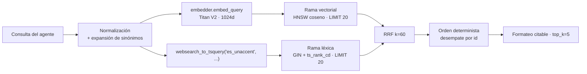

# RFC-0003 — Recuperación híbrida: HNSW + PostgreSQL FTS + Reciprocal Rank Fusion

| Campo | Valor |
| :--- | :--- |
| **Estado** | Aprobado |
| **Depende de** | RFC-0002, RFC-0006 |
| **ADRs** | ADR-0002 |
| **Fecha** | 2026-08-22 |

---

## 1. Contexto y problema

Las dos familias de recuperación fallan en sentidos opuestos sobre un CV:

- **Solo vectorial:** falla en consultas con entidades exactas. *"¿Trabajó en Banorte?"* o
  *"¿Sabe Terraform?"* son preguntas donde el token literal importa más que la semántica, y un
  embedding denso sobre un corpus pequeño produce vecinos plausibles pero
  equivocados (todas las experiencias se parecen entre sí).
- **Solo léxica:** falla en consultas parafraseadas. *"¿tiene experiencia liderando gente?"*
  no comparte ningún término con *"responsable de un equipo de 6 personas"*.

Un CV recibe ambos tipos de pregunta en la misma conversación. Este RFC define la recuperación
híbrida y su fusión.

## 2. Alcance

**Entra:** embebido de la consulta, rama vectorial, rama léxica, fusión RRF, ordenamiento
determinista, formateo del contexto y contrato de la herramienta.

**No entra:** el DDL y los índices (RFC-0006), la decisión del agente sobre *cuándo* buscar
(RFC-0004), reranking con modelo dedicado (deuda declarada, §9).

## 3. Diseño de la consulta



> **Modificado por RFC-0012.** La rama vectorial usa **`embedder.embed_query(...)`**, nunca
> `embed_documents`. Titan V2 es simétrico y hoy ambos métodos hacen lo mismo, pero la
> contingencia (`nomic-embed-text`) es asimétrica: usar el lado equivocado degradaría la
> recuperación sin producir ningún error. Respetar la distinción ahora es lo que hace que
> activar la contingencia sea gratis. El vector tiene **1024 dimensiones**.

### 3.1 Normalización de la consulta

1. Recorte y colapso de espacios; se conservan mayúsculas para el embedding.
2. Para la rama léxica: `unaccent` + minúsculas (el usuario escribe "banorte", el corpus dice
   "Banorte"; el español acentuado hace imprescindible `unaccent`).
3. **Expansión de sinónimos** con el diccionario compartido de RFC-0002 §5: la consulta léxica
   `k8s` se convierte en `k8s | kubernetes`. La consulta vectorial **no** se expande: el
   embedding ya captura la relación y la expansión introduce ruido.

### 3.2 Rama vectorial

```sql
SELECT id, ROW_NUMBER() OVER (ORDER BY embedding <=> %(qv)s::vector, id) AS rank
FROM rag_cv.active_chunks
ORDER BY embedding <=> %(qv)s::vector, id
LIMIT %(candidates)s;
```

`SET LOCAL hnsw.ef_search = 40;` antes de la consulta: con ~60–200 fragmentos, 40 da recall
prácticamente perfecto a coste despreciable. El valor es configurable por
`RETRIEVAL_EF_SEARCH`.

### 3.3 Rama léxica

```sql
SELECT id, ROW_NUMBER() OVER (ORDER BY ts_rank_cd(tsv, query) DESC, id) AS rank
FROM rag_cv.active_chunks, websearch_to_tsquery('public.es_unaccent', %(q)s) AS query
WHERE tsv @@ query
ORDER BY ts_rank_cd(tsv, query) DESC, id
LIMIT %(candidates)s;
```

Se usa `websearch_to_tsquery` en lugar de `plainto_tsquery`: tolera comillas y operadores que
un usuario escribe de forma natural, y no falla ante una consulta con signos de puntuación.
El `tsv` se genera con `unaccent` en el trigger (RFC-0006 §4), de modo que la consulta también
se desacentúa antes de construir el `tsquery`.

### 3.4 Fusión RRF

```sql
WITH semantic AS ( ... ), lexical AS ( ... ),
fused AS (
  SELECT COALESCE(s.id, l.id) AS id,
         COALESCE(1.0 / (%(rrf_k)s + s.rank), 0.0) * %(w_sem)s
       + COALESCE(1.0 / (%(rrf_k)s + l.rank), 0.0) * %(w_lex)s AS score,
         s.rank AS sem_rank, l.rank AS lex_rank
  FROM semantic s FULL OUTER JOIN lexical l ON s.id = l.id
)
SELECT c.id, c.source_document_id, c.ordinal, c.content, c.metadata,
       f.score, f.sem_rank, f.lex_rank
FROM fused f JOIN rag_cv.active_chunks c ON c.id = f.id
ORDER BY f.score DESC, c.id
LIMIT %(top_k)s;
```

**Por qué RRF y no una suma ponderada de puntuaciones:** la distancia coseno y `ts_rank_cd`
viven en escalas distintas y no comparables, y `ts_rank_cd` además no está acotado. Normalizar
ambas requeriría min-max por consulta, que es inestable cuando una rama devuelve pocos
resultados. RRF opera sobre **rangos**, no sobre puntuaciones, y es robusto sin calibración.

`k = 60` es el valor del artículo original de Cormack et al.; funciona como amortiguador que
impide que el primer resultado de una rama domine. Con `k` pequeño (p. ej. 1) la fusión
degenera hacia "gana quien tenga el mejor rango en cualquier rama".

`w_sem = w_lex = 1.0` por defecto. Se exponen como configuración (`RRF_WEIGHT_SEMANTIC`,
`RRF_WEIGHT_LEXICAL`) porque son la palanca de ajuste más barata cuando la evaluación muestra
sesgo hacia una rama, pero **cualquier cambio de estos pesos exige volver a correr la suite de
evaluación** (RFC-0009).

### 3.5 Orden y selección

La fusión se ordena por `score DESC, id` para que los empates sean deterministas. Después se
corta a `top_k = 5`. El esquema QA/PROD no define campos de unidad, sección, tipo o fechas; por
ello este contrato no aplica filtros ni límites de presentación basados en esos valores. Un
filtro futuro deberá leer claves documentadas de `metadata`, estar respaldado por una migración e
índice cuando sea necesario, y añadir sus pruebas antes de exponerse en la herramienta.

### 3.6 Umbral de relevancia

Si el mejor `score` fusionado es menor que `RETRIEVAL_MIN_SCORE` (por defecto `0.016`,
equivalente a estar fuera del top-3 en ambas ramas), la herramienta devuelve **cero
resultados** en vez de contexto irrelevante. Es preferible que el agente diga "no consta" a
que fundamente una respuesta en ruido.

## 4. Contrato de la herramienta

El adaptador consulta únicamente `rag_cv.active_chunks`, que expone solo fragmentos de la versión
actual e indexada del documento fuente. Sus únicos campos de recuperación son `id`,
`source_document_id`, `ordinal`, `content`, `metadata`, `embedding` y `tsv`; el contrato no
asume ningún otro campo de presentación ni filtro.

```python
@dataclass(frozen=True)
class RetrievedChunk:
    id: UUID
    source_document_id: UUID
    ordinal: int
    content: str         # texto del fragmento, listo para el prompt
    metadata: Mapping[str, Any]
    score: float
    sem_rank: int | None
    lex_rank: int | None

async def hybrid_search(
    query: str,
    *,
    top_k: int = 5,
    candidates: int = 20,
) -> list[RetrievedChunk]: ...
```

### 4.1 Formato devuelto al agente

```text
<contexto_cv>
[F1 | fragmento 0 del documento fuente]
<contenido del fragmento>

[F2 | fragmento 3 del documento fuente]
<contenido del fragmento>
</contexto_cv>

Instrucción de uso: responde únicamente con la información contenida entre las etiquetas
<contexto_cv>. Cita las referencias como [F1], [F2]. Si la respuesta no está ahí, dilo.
```

Los identificadores `F1..Fn` son **locales a la llamada**, no globales: obligan al modelo a
citar lo que acaba de ver y permiten mapear la cita al `id` real en los metadatos de la
respuesta (RFC-0005 §4). El formato base solo usa `ordinal`; una etiqueta legible adicional se
permite exclusivamente cuando una clave de `metadata` haya sido documentada y validada. El
contenido recuperado va delimitado por etiquetas y precedido de la instrucción, materializando
la invariante I-2 (contenido = datos, no instrucciones).

## 5. Presupuesto y límites

| Parámetro | Valor por defecto | Variable |
| :--- | :--- | :--- |
| Candidatos por rama | 20 | `RETRIEVAL_CANDIDATES` |
| `top_k` final | 5 | `RETRIEVAL_TOP_K` |
| `hnsw.ef_search` | 40 | `RETRIEVAL_EF_SEARCH` |
| `k` de RRF | 60 | `RRF_K` |
| Umbral mínimo de score | 0.016 | `RETRIEVAL_MIN_SCORE` |
| Timeout de la consulta | 2 000 ms | `RETRIEVAL_TIMEOUT_MS` |
| Presupuesto de contexto | 2 500 tokens | `RETRIEVAL_CONTEXT_BUDGET` |

Si los `top_k` fragmentos superan el presupuesto de tokens, se recortan por la cola (los de
menor score), nunca truncando un fragmento a la mitad.

## 6. Fallos y degradación

| Fallo | Detección | Comportamiento |
| :--- | :--- | :--- |
| El embedder no responde | Timeout/excepción | Se ejecuta **solo la rama léxica** y se marca `degraded=true` en el log y en los metadatos de la respuesta |
| PostgreSQL no responde | Timeout | La herramienta devuelve error controlado; el agente responde 503 vía la capa de servicio, sin inventar |
| `websearch_to_tsquery` produce consulta vacía (p. ej. solo *stop words*) | `tsquery` vacío | La rama léxica se omite; solo vectorial |
| Ambas ramas vacías | 0 filas | Devuelve `[]`; el agente aplica RF-4 |
| Score máximo bajo umbral | Comparación | Devuelve `[]` con motivo `below_threshold` en el log |

La degradación a "solo léxica" es deliberada: mantiene el servicio útil ante un fallo de
Bedrock Embeddings, y queda registrada para que la métrica de calidad no se degrade en
silencio.

## 7. Criterios de aceptación

| # | Criterio | Verificación |
| :--- | :--- | :--- |
| CA-1 | Una consulta con entidad exacta ("Banorte") recupera su fragmento en el top-1 | `tests/integration/test_retrieval.py::test_exact_entity` |
| CA-2 | Una consulta parafraseada ("liderar personas") recupera el fragmento de liderazgo en top-3 | `test_retrieval.py::test_paraphrase` |
| CA-3 | La fusión RRF con una sola rama activa produce el mismo orden que esa rama | `tests/unit/test_rrf.py::test_single_branch_identity` |
| CA-4 | La fusión es determinista ante empates (desempate por `id`) | `test_rrf.py::test_deterministic_ties` |
| CA-5 | Ambas ramas y la carga final consultan únicamente `rag_cv.active_chunks`; los fragmentos de una fuente no actual no aparecen | `test_retrieval.py::test_uses_active_chunks_only` |
| CA-6 | Una consulta sin relación con el corpus devuelve `[]` | `test_retrieval.py::test_below_threshold_returns_empty` |
| CA-7 | Si el embedder falla, la búsqueda sigue devolviendo resultados léxicos y marca `degraded` | `test_retrieval.py::test_embedding_failure_degrades` |
| CA-11 | La rama vectorial llama a `embed_query`, nunca a `embed_documents` | `test_retrieval.py::test_uses_query_side` |
| CA-8 | La consulta acentuada y la no acentuada dan el mismo resultado léxico | `test_retrieval.py::test_unaccent` |
| CA-9 | El bloque devuelto respeta el formato de §4.1, con etiquetas y `[Fn]` | `tests/unit/test_formatter.py` |
| CA-10 | p95 de `hybrid_search` ≤ 250 ms sobre corpus de 200 fragmentos | `tests/integration/test_retrieval_perf.py` |

## 8. Estrategia de pruebas

- **Unitarias:** RRF puro (sin BD) con rangos sintéticos; ordenamiento determinista; formateo; expansión
  de sinónimos.
- **Integración:** PostgreSQL efímero con corpus de prueba de 30 fragmentos
  y embeddings **deterministas falsos** (`hash → vector` normalizado) para no depender de
  Bedrock ni pagar por ejecución de CI. La rama léxica se prueba con el motor real.
  La base efímera sale de `testcontainers` en Linux y de una base local `ragcv_test_<pid>` en
  el Windows de DEV, seleccionadas por `TEST_DB_MODE` (RFC-0011 §8). **Las pruebas son las
  mismas**: solo cambia de dónde sale la conexión. La base de prueba se crea con la misma
  configuración regional ICU que la de desarrollo; si difiere, las pruebas de la rama léxica
  mienten.
- **Evaluación:** *context recall* sobre el conjunto dorado (RFC-0009); es la prueba que mide
  la calidad real de este RFC.

## 9. Deuda declarada y condiciones de revisión

| Deuda | Condición para reabrirla |
| :--- | :--- |
| Sin reranker dedicado (p. ej. Cohere Rerank en Bedrock) | Si *context recall* < 0.85 con `top_k=5`, o si el corpus supera 500 fragmentos |
| Sin *query rewriting* multi-consulta | Si la evaluación muestra fallo sistemático en preguntas compuestas ("compara su experiencia en X e Y") |
| Sin caché de embeddings de consulta | Si el costo de embeddings supera el 15 % del costo mensual |
| Pesos RRF fijos en 1.0/1.0 | Si la evaluación muestra sesgo consistente hacia una rama |

## 10. Correcciones respecto al documento base

El SQL de `conversacion_aws_bedrock.md` fue el punto de partida. Cambios y su motivo:

| Cambio | Motivo |
| :--- | :--- |
| `plainto_tsquery` → `websearch_to_tsquery` | Tolera puntuación y comillas de una consulta real sin lanzar excepción |
| Añadido `unaccent` en indexación y consulta | Sin él, "informatica" no recupera "informática" |
| `SELECT contenido` → devolver también `id`, `source_document_id`, `ordinal`, `metadata`, `score` y rangos | Los identificadores reales dan citas y trazabilidad sin inventar campos fuera del esquema QA/PROD |
| Consulta directa de chunks → `rag_cv.active_chunks` | La vista es el contrato de lectura que excluye versiones de fuente no actuales o no indexadas |
| Añadido umbral mínimo de score | Sin él, siempre se devuelven 4 fragmentos aunque no vengan a cuento, e invitan a alucinar |
| Añadido `ef_search` explícito | El valor por defecto (40) es correcto, pero debe ser explícito y configurable, no implícito |
| Conexión `psycopg2.connect` por llamada → pool async | Abrir conexión por petición añade ~30 ms y agota RDS bajo carga |
| Excepción capturada y devuelta como texto al modelo | Devolver `"Error consultando..."` como resultado de la herramienta lleva al modelo a improvisar; debe propagarse como error |

## Contrato de auditoría (gate ADU)

| # | Comprobación | Cómo se verifica | Severidad si falla |
| :--- | :--- | :--- | :--- |
| A-1 | La fusión usa rangos (RRF), no puntuaciones normalizadas | Lectura del SQL | Bloqueante |
| A-2 | El SQL está parametrizado; no hay interpolación de cadenas | Búsqueda de f-strings/`%` en SQL: 0 resultados | Bloqueante |
| A-3 | Existe umbral mínimo y devuelve `[]` cuando no se alcanza | CA-6 | Mayor |
| A-4 | Ambas ramas y la carga final usan `rag_cv.active_chunks`; no consultan tablas de chunks directamente | Lectura del SQL + CA-5 | Bloqueante |
| A-5 | El fallo del embedder degrada a léxica y lo registra, no lanza 500 | CA-7 | Mayor |
| A-6 | El error de BD **no** se devuelve al modelo como texto de resultado | Lectura de `search_cv.py` | Bloqueante |
| A-7 | La conexión sale de un pool, no se abre por llamada | Lectura de `db/engine.py` y de la herramienta | Mayor |
| A-8 | El bloque de contexto delimita el contenido como datos (I-2) | CA-9 | Bloqueante |
| A-9 | Las pruebas de integración usan `FakeEmbedder`, no el proveedor real | Revisar fixtures | Menor |
| A-9c | La rama vectorial usa `embed_query` | CA-11 + `grep -n "embed_documents" app/retrieval/hybrid.py` sin resultados | Bloqueante |
| A-9b | La suite de integración pasa en los dos modos de `TEST_DB_MODE` | Ejecución en Windows y en el CI | Mayor |
| A-10 | Todos los parámetros de §5 son configurables y tienen el valor por defecto indicado | Lectura de `config.py` | Menor |
