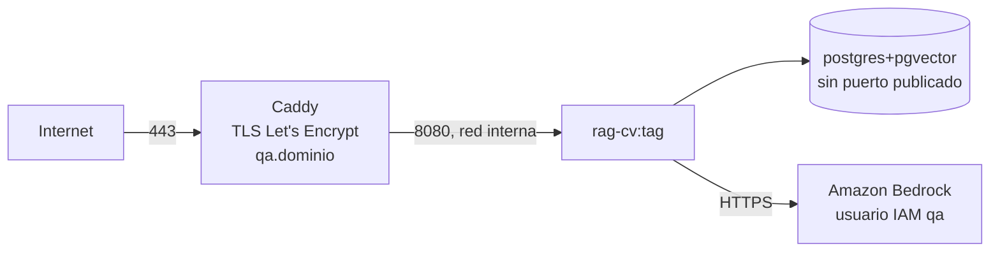
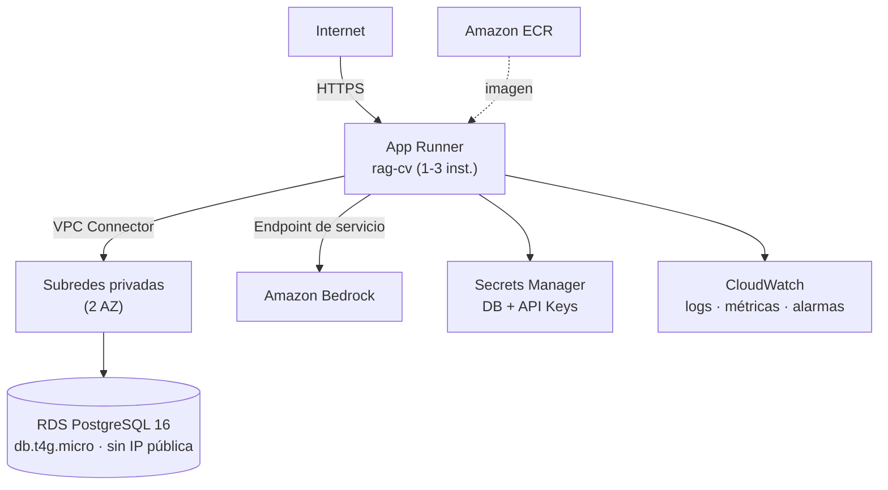

# RFC-0007 — Entornos e infraestructura: DEV local, QA en VPS Hostinger, PROD en AWS

| Campo | Valor |
| :--- | :--- |
| **Estado** | Aprobado |
| **Depende de** | RFC-0001, RFC-0006 |
| **ADRs** | ADR-0001 |
| **Fecha** | 2026-08-22 |

---

## 1. Contexto y problema

Tres entornos con infraestructuras deliberadamente distintas: **Windows nativo** para
desarrollo, **Ubuntu en un VPS de Hostinger** para QA y **AWS** para producción. El requisito
duro es que **la misma imagen de contenedor corra en QA y en PROD** (RNF-10): la imagen se
construye una vez en el CI, se valida en QA y se promueve a PROD por digest, sin reconstruir.

DEV queda fuera de esa cadena a propósito: es un entorno nativo, sin Docker, optimizado para
iterar rápido. Eso introduce un salto real de sistema operativo entre donde se escribe el
código y donde se ejecuta, con consecuencias concretas —psycopg y el bucle de eventos de
Windows, finales de línea, sensibilidad a mayúsculas, configuración regional de PostgreSQL—
que se detallan en RFC-0011 y se contienen en el pipeline.

Este RFC define la topología de cada entorno, cómo se obtienen las credenciales en cada sitio
y qué se acepta que sea distinto.

## 2. Alcance

**Entra:** definición de los tres entornos, red y seguridad de cada uno, gestión de secretos,
imagen de contenedor, matriz de diferencias aceptadas, IaC de PROD y costos estimados.

**No entra:** el detalle del entorno Windows de desarrollo (RFC-0011), el pipeline que despliega
(RFC-0008), la operación diaria (RFC-0010).

## 3. Matriz de entornos

| Aspecto | DEV (Windows nativo) | QA (Ubuntu, VPS Hostinger) | PROD (AWS) |
| :--- | :--- | :--- | :--- |
| Sistema operativo | Windows 10/11 x64 | Ubuntu Server 24.04 LTS | Amazon Linux (gestionado por App Runner) |
| Cómputo | Proceso nativo: `python -m app.dev_server` | `docker compose` + Caddy | AWS App Runner |
| Base de datos | **PostgreSQL 16 nativo + pgvector compilado** | `pgvector/pgvector:pg16` en contenedor, red interna | Amazon RDS PostgreSQL 16 |
| Contenedores | **No hay Docker** | Docker Engine + Compose v2 | Imagen desde ECR |
| Generación | Proveedor designado por `PROVEEDOR` (RFC-0013) | Ídem, mismo proveedor que PROD | Ídem |
| Embeddings | Titan V2 vía Bedrock — **misma credencial que la generación** | Ídem | Ídem |
| Credenciales AWS | `AWS_PROFILE` / SSO en `%USERPROFILE%\.aws` | Claves de usuario IAM en `.env` con permisos 600 | Rol IAM de la instancia, sin claves |
| Secretos de la app | `.env` local (git-ignored, protegido por ACL) | `.env` en el VPS + `docker compose --env-file` | AWS Secrets Manager |
| Bucle de eventos | `asyncio` + `WindowsSelectorEventLoopPolicy` | `uvloop` | `uvloop` |
| TLS | No (http://127.0.0.1:8080) | Caddy con Let's Encrypt, dominio `qa.<dominio>` | Dominio de App Runner + certificado gestionado |
| Exposición de la BD | `listen_addresses = 'localhost'` | **Sin puerto publicado**: solo red del compose | Subredes privadas, sin IP pública |
| Observabilidad | Logs a la consola | Logs JSON + rotación en el VPS | CloudWatch Logs + métricas + alarmas |
| Datos | Corpus de ejemplo | Corpus real | Corpus real |
| Escala | 1 proceso, 1 worker | 1 instancia, 2 workers | 1–3 instancias, autoescalado |

La consecuencia importante de esta matriz: **el artefacto que se promueve es la imagen de
contenedor, y DEV no la produce ni la ejecuta.** La imagen nace en el CI, se valida en QA y se
promueve a PROD por digest (RFC-0008). DEV valida el código; el CI valida el artefacto.

## 4. DEV — Windows nativo

El detalle completo —instalación de pgvector con `nmake`, creación de la base con ICU,
la incompatibilidad de psycopg con el bucle de eventos de Windows, finales de línea, tareas
multiplataforma y estrategia de pruebas sin Docker— vive en
**[RFC-0011](./RFC-0011-entorno-dev-windows-nativo.md)**, que es el documento normativo de este
entorno. Aquí solo queda el resumen operativo.

### 4.1 Puesta en marcha

```powershell
git clone <repo> ; cd rag-cv
.\scripts\bootstrap-dev.ps1        # idempotente: verifica, crea BD, migra e indexa
aws sso login --profile ragcv-dev
python -m app.dev_server            # http://127.0.0.1:8080
```

### 4.2 Ciclo de trabajo

```powershell
invoke lint                          # ruff + mypy + import-linter
invoke test --kind unit
invoke test --kind integration       # usa TEST_DB_MODE=local contra el PostgreSQL nativo
invoke index                         # reindexar tras editar corpus/cv.md
invoke evals --suite pr              # requiere credenciales de Bedrock
```

### 4.3 Restricciones propias de este entorno

| Restricción | Origen | Cómo se contiene |
| :--- | :--- | :--- |
| psycopg async rechaza `ProactorEventLoop` | Windows | `app/core/platform.py` + arranque por `app.dev_server` (RFC-0011 §5.1) |
| `uvloop` no existe en Windows | Windows | Marcador `sys_platform != 'win32'` en las dependencias |
| pgvector requiere compilarse con `nmake` | No hay binarios oficiales para Windows | Procedimiento en RFC-0011 §4.2, verificado por el bootstrap |
| Configuración regional del clúster | `Spanish_*.1252` no es compatible con UTF8 | Base creada con proveedor ICU `es-MX` y prueba de verificación obligatoria |
| Sin Docker ⇒ sin `testcontainers` | No hay Docker Desktop | `TEST_DB_MODE=local`: base efímera en el PostgreSQL nativo |
| DEV necesita credenciales de AWS y red para embeddings | Titan solo existe como API de Bedrock (ADR-0004) | Es la **misma** credencial que ya hace falta para la generación: `aws sso login`. Contingencia offline: `EMBEDDER=ollama`, a cambio de recrear la columna y reindexar la base local |
| Sin Docker ⇒ la imagen no se prueba en local | No hay Docker Desktop | Se construye y se somete a humo en el CI (RFC-0008 job 6) |
| NTFS no distingue mayúsculas | Windows | El CI en `ubuntu-latest` es la autoridad |

**Nota deliberada:** no se emula Bedrock. Un doble local de un LLM da falsa confianza sobre
formato de herramientas y latencias. Las pruebas que no necesitan modelo usan un proveedor
falso determinista; las que sí, se marcan `@pytest.mark.bedrock` y se ejecutan contra Bedrock
real con el perfil del desarrollador.

## 5. QA — VPS de Hostinger

### 5.1 Topología



- **Ubuntu Server 24.04 LTS**, un solo host, `docker compose` con tres servicios: `caddy`,
  `api`, `db`. Docker Engine + Compose v2 desde el repositorio oficial de Docker (no el paquete
  `docker.io` de Ubuntu, que va por detrás).
- La base de datos **no publica puertos**: solo es alcanzable por el nombre de servicio dentro
  de la red del compose (RNF-7 también aplica a QA).
- Caddy termina TLS y es el único puerto abierto junto a SSH.
- Firewall del VPS (`ufw`): 22 (con clave, sin contraseña), 80, 443. Todo lo demás cerrado.
- `fail2ban` en SSH. SSH solo por clave, `PermitRootLogin no`.

### 5.2 Credenciales de AWS en QA

QA no puede heredar un rol de instancia, así que usa un **usuario IAM dedicado**
`rag-cv-qa-invoker` con la política mínima de §7.2 y **sin acceso a consola**. Sus claves viven
en `/opt/rag-cv/.env` con permisos `600`, propiedad de un usuario de servicio sin shell, y se
rotan cada 90 días (recordatorio en el runbook). No hay acceso a RDS ni a Secrets Manager desde
QA: sus secretos son locales.

### 5.3 Despliegue en QA

```bash
# ejecutado por el pipeline vía SSH (RFC-0008)
docker compose -f /opt/rag-cv/docker-compose.qa.yml pull api
docker compose -f /opt/rag-cv/docker-compose.qa.yml run --rm api alembic upgrade head
docker compose -f /opt/rag-cv/docker-compose.qa.yml up -d api
docker compose -f /opt/rag-cv/docker-compose.qa.yml run --rm api \
    python -m app.ingestion.indexer --corpus corpus/cv.md
curl -fsS https://qa.<dominio>/readyz
```

**Por qué un VPS y no un segundo entorno en AWS:** QA existe para validar el artefacto y la
conversación con datos reales, no para validar la infraestructura de PROD. Un VPS a coste fijo
bajo cumple eso, y además fuerza a que la aplicación no dependa de nada específico de AWS más
allá de Bedrock —lo que la hace portable y prueba que la configuración es realmente externa.
La contrapartida se declara en §8.

## 6. PROD — AWS

### 6.1 Topología



### 6.2 Componentes

| Recurso | Configuración |
| :--- | :--- |
| **ECR** | Repositorio `rag-cv`, escaneo de imágenes activado, política de ciclo de vida: conservar 10 etiquetas |
| **App Runner** | 1 vCPU / 2 GB, puerto 8080, autoescalado 1–3, concurrencia 20 req/instancia, health check HTTP `/readyz` |
| **VPC Connector** | 2 subredes privadas en 2 AZ, `sg-apprunner-egress` |
| **RDS** | PostgreSQL 16, `db.t4g.micro`, 20 GB gp3, Single-AZ, sin acceso público, cifrado en reposo (KMS), backups 7 días, ventana de mantenimiento fuera de horario |
| **Secrets Manager** | `rag-cv/prod/db` (credenciales, rotación gestionada) y `rag-cv/prod/api-keys` (claves de la propia API). **No hay secretos de proveedor de modelos**: con `PROVEEDOR=bedrock` y `EMBEDDER=titan`, el rol de instancia cubre generación y embeddings |
| **CloudWatch** | Grupo de logs con retención 30 días, métricas propias en namespace `RagCV`, alarmas de §RFC-0010 |
| **EventBridge** | Regla diaria para el trabajo de retención |
| **Budgets** | Presupuesto mensual con alerta al 50 %, 80 % y 100 % de USD 60 |

**No se despliega NAT Gateway.** App Runner sale a Bedrock y a Secrets Manager por su propia
ruta pública gestionada; solo el tráfico hacia la VPC pasa por el conector. Un NAT costaría más
que todo el resto del entorno junto y no aporta nada aquí. Si en el futuro se exige que el
tráfico a Bedrock no salga a internet, la alternativa es un **VPC endpoint de interfaz**
(`com.amazonaws.<region>.bedrock-runtime`), y entonces sí todo el egreso pasa por la VPC;
queda registrado como condición de revisión.

### 6.3 Grupos de seguridad

| Grupo | Entrada | Salida |
| :--- | :--- | :--- |
| `sg-apprunner-egress` | Ninguna | TCP 5432 hacia `sg-rds` |
| `sg-rds` | TCP 5432 **desde `sg-apprunner-egress`** (referencia al grupo, no CIDR) | Ninguna |

Referenciar el grupo de seguridad en vez de un CIDR evita que un cambio de subredes abra la
base de datos a más de lo previsto.

## 7. IAM

> **Modificado por RFC-0012 y RFC-0013.** La política cubre **dos** modelos: el de generación
> (`PROVEEDOR=bedrock`) y el de embeddings (`EMBEDDER=titan`). Si la generación se moviera a
> `anthropic` u `openai_compatible`, el ARN del modelo de generación se retira y queda solo el de
> embeddings. Los permisos **no se conceden "por si acaso"**: se retiran cuando dejan de usarse, y
> esa retirada es una comprobación de auditoría (A-11).

### 7.1 Rol de instancia de App Runner (`rag-cv-prod-instance`)

```json
{
  "Version": "2012-10-17",
  "Statement": [
    {
      "Sid": "BedrockInvoke",
      "Effect": "Allow",
      "Action": ["bedrock:InvokeModel", "bedrock:InvokeModelWithResponseStream"],
      "Resource": [
        "arn:aws:bedrock:*::foundation-model/anthropic.claude-haiku-4-5-20251001-v1:0",
        "arn:aws:bedrock:us-east-2:<account-id>:inference-profile/us.anthropic.claude-haiku-4-5-20251001-v1:0",
        "arn:aws:bedrock:*::foundation-model/amazon.titan-embed-text-v2:0"
      ]
    },
    {
      "Sid": "GuardrailApply",
      "Effect": "Allow",
      "Action": ["bedrock:ApplyGuardrail"],
      "Resource": "arn:aws:bedrock:us-east-1:<account-id>:guardrail/<guardrail-id>"
    },
    {
      "Sid": "ReadSecrets",
      "Effect": "Allow",
      "Action": ["secretsmanager:GetSecretValue"],
      "Resource": [
        "arn:aws:secretsmanager:us-east-1:<account-id>:secret:rag-cv/prod/db-*",
        "arn:aws:secretsmanager:us-east-1:<account-id>:secret:rag-cv/prod/api-keys-*"
      ]
    },
    {
      "Sid": "Telemetry",
      "Effect": "Allow",
      "Action": ["cloudwatch:PutMetricData"],
      "Resource": "*",
      "Condition": {"StringEquals": {"cloudwatch:namespace": "RagCV"}}
    }
  ]
}
```

> **Corrección respecto al documento base:** ese documento propone
> `"Action": ["bedrock:InvokeModel", ...], "Resource": "*"`. Con `Resource: "*"` cualquier
> modelo del catálogo queda invocable, incluidos los caros: es una vía directa a una factura
> inesperada si alguien altera `BEDROCK_MODEL_ID`. Aquí se restringe a los ARN de los dos
> modelos y del perfil de inferencia efectivamente usados.

### 7.2 Usuario IAM de QA (`rag-cv-qa-invoker`)

Misma política de `BedrockInvoke` (mismos ARN), **sin** `secretsmanager` ni `cloudwatch`, y con
una condición adicional de origen si el VPS tiene IP fija:

```json
{"Condition": {"IpAddress": {"aws:SourceIp": ["<ip-del-vps>/32"]}}}
```

## 8. Diferencias aceptadas entre entornos

Declararlas es parte del diseño: una diferencia no declarada es una sorpresa en producción.

### 8.1 DEV (Windows) frente a QA/PROD (Linux)

| Diferencia | Riesgo | Mitigación |
| :--- | :--- | :--- |
| Sistema operativo distinto | Código que solo funciona en Windows (rutas, mayúsculas, permisos) | El CI en `ubuntu-latest` es la autoridad de merge; job adicional en `windows-latest` para el camino inverso |
| Bucle de eventos `asyncio`/Selector vs `uvloop` | Diferencias de rendimiento y de temporización asíncrona | Ninguna cifra de latencia se toma en DEV; RNF-1/2/3 se miden en QA y PROD |
| PostgreSQL nativo con ICU vs contenedor `pgvector/pgvector:pg16` | Configuración regional divergente ⇒ búsqueda léxica distinta sin dar error | Prueba de configuración de texto obligatoria en ambos sistemas (RFC-0011 §4.3, CA-3) |
| Sin Docker en DEV | El `Dockerfile` y el usuario no-root no se prueban localmente | Job de build y humo del contenedor tempranos en el CI |
| Sin `testcontainers` en DEV | La suite de integración podría dejar de correrse en local | Mismo conjunto de pruebas con `TEST_DB_MODE=local` (RFC-0011 §8) |
| Finales de línea CRLF | Scripts `.sh` inservibles en el VPS | `.gitattributes` con LF forzado para `*.sh` y `Dockerfile` + verificación en CI |

### 8.2 QA (VPS) frente a PROD (AWS)

| Diferencia | Riesgo | Mitigación |
| :--- | :--- | :--- |
| Postgres en contenedor (QA) vs RDS (PROD) | Comportamiento de parámetros, límites de conexión | Misma versión mayor (16) y misma versión de pgvector; el pool se prueba con los límites de PROD |
| Credenciales por clave (QA) vs rol (PROD) | Un fallo de la cadena de credenciales solo aparece en PROD | Ambos entornos usan la cadena por defecto de boto3; nunca se pasan claves en código |
| Sin autoescalado en QA | Comportamiento bajo concurrencia no se valida en QA | Prueba de carga contra PROD tras el primer despliegue, con presupuesto de tokens acotado |
| Sin Secrets Manager en QA | La ruta de carga de secretos difiere | La interfaz `SecretsProvider` es la misma; solo cambia la implementación, y ambas se prueban |
| Sin CloudWatch en QA | Alarmas no verificables en QA | Las alarmas se validan en PROD con una inyección de fallo controlada |

## 9. Infraestructura como código

- **PROD:** Terraform en `infra/terraform/`, con estado remoto en S3 + bloqueo en DynamoDB.
  Módulos: `network`, `database`, `apprunner`, `secrets`, `observability`. `terraform plan` es
  obligatorio en el PR y su salida se pega en el Informe de Implementación.
- **QA:** el `docker-compose.qa.yml` y la configuración de Caddy están versionados; el
  aprovisionamiento del VPS (usuarios, ufw, fail2ban, docker) está en un script idempotente
  `infra/vps/bootstrap.sh`. No se usa un gestor de configuración completo: para un host, el
  script versionado tiene mejor relación coste/beneficio y es auditable de un vistazo.
- Ningún recurso de PROD se crea a mano en la consola. Si se crea para depurar, se importa a
  Terraform o se destruye en la misma jornada.

## 10. Costos estimados de PROD (mensual, tráfico bajo)

| Concepto | Estimación |
| :--- | :--- |
| App Runner (1 instancia activa, 1 vCPU/2 GB, uso bajo) | USD 20–30 |
| RDS `db.t4g.micro` + 20 GB gp3 | USD 15–18 |
| ECR (< 1 GB) | USD 0.10 |
| Secrets Manager (2 secretos) | USD 0.80 |
| CloudWatch (logs 30 días, métricas propias) | USD 2–4 |
| Bedrock (≈1 000 turnos/mes) | USD 8–15 |
| **Total** | **≈ USD 46–68** |

Coincide con el presupuesto de RNF-6 (USD 60) en el rango bajo. La palanca principal si se
excede es el autoescalado a cero de App Runner fuera de horario, que se descarta en la v1
porque el arranque en frío rompería RNF-1.

## 11. Criterios de aceptación

| # | Criterio | Verificación |
| :--- | :--- | :--- |
| CA-1 | `.\scripts\bootstrap-dev.ps1` deja un DEV funcional en Windows y `/readyz` responde 200 | Ejecución manual en máquina limpia (RFC-0011 CA-1, CA-5) |
| CA-2 | La imagen es idéntica (mismo digest) en QA y PROD para una misma versión | Comparar digests de ECR y del VPS |
| CA-2b | QA corre Ubuntu 24.04 LTS con Docker Engine del repositorio oficial | `lsb_release -a` y `docker version` en el VPS |
| CA-3 | En QA, el puerto 5432 no es alcanzable desde fuera del host | `nmap`/`nc` desde otra máquina |
| CA-4 | En PROD, RDS no tiene IP pública y su grupo de seguridad solo admite el de App Runner | `terraform plan` + consulta a la API de AWS |
| CA-5 | El rol de instancia no contiene `Resource: "*"` para `bedrock:InvokeModel` | Revisión de la política |
| CA-6 | La aplicación arranca en PROD sin ninguna variable con secreto en texto plano | Inspección de la configuración del servicio |
| CA-7 | `terraform plan` sobre la infraestructura desplegada no muestra deriva | Ejecución en CI programada |
| CA-8 | El presupuesto de AWS existe con alertas al 50/80/100 % | Consulta a Budgets |
| CA-9 | El script de aprovisionamiento del VPS es idempotente | Ejecutarlo dos veces y comparar estado |

## 12. Riesgos

| Riesgo | Mitigación |
| :--- | :--- |
| Claves IAM de QA filtradas | Política mínima + condición de IP + rotación a 90 días + escaneo de secretos en CI |
| El VPS queda desactualizado respecto a PROD | El despliegue a QA es automático en cada merge a `main` (RFC-0008) |
| Código escrito en Windows que falla en Linux | El CI en `ubuntu-latest` bloquea el merge; ver RFC-0011 §9 |
| Deriva manual en la consola de AWS | `terraform plan` programado que alerta si detecta cambios |
| App Runner sin arranque en frío controlado | Mínimo de 1 instancia; no se escala a cero |
| Fuga de costos por Bedrock | Política IAM restringida a dos modelos + presupuesto con alarma + límite de tasa por clave |

## Contrato de auditoría (gate ADU)

| # | Comprobación | Cómo se verifica | Severidad si falla |
| :--- | :--- | :--- | :--- |
| A-1 | La misma imagen se usa en QA y PROD (DEV es nativo); el `Dockerfile` no tiene ramas por entorno | Lectura del `Dockerfile` + CA-2 | Bloqueante |
| A-2 | Ningún secreto está versionado en el repositorio | `gitleaks` + revisión de `infra/` | Bloqueante |
| A-3 | La política de Bedrock restringe por ARN de modelo | CA-5 | Bloqueante |
| A-4 | RDS y el Postgres de QA no son accesibles desde internet | CA-3, CA-4 | Bloqueante |
| A-5 | El grupo de seguridad de RDS referencia el grupo de App Runner, no un CIDR | Lectura del Terraform | Mayor |
| A-6 | Las migraciones son un paso del despliegue, no del arranque | Revisión del compose y del pipeline | Bloqueante |
| A-7 | Existe `infra/vps/bootstrap.sh` idempotente con ufw y fail2ban | CA-9 | Mayor |
| A-8 | Las tablas de diferencias de §8.1 y §8.2 están actualizadas respecto a lo implementado | Comparación | Menor |
| A-8b | Las restricciones de §4.3 están efectivamente contenidas en el código o en el pipeline | Contraste con el contrato de auditoría de RFC-0011 | Mayor |
| A-9 | El presupuesto y sus alertas existen | CA-8 | Mayor |
| A-10 | El estado de Terraform es remoto y con bloqueo | Lectura del `backend` | Mayor |
| A-11 | El rol de instancia **no** conserva permisos de Bedrock si `PROVEEDOR` no es `bedrock` | Comparar la política desplegada con la configuración activa | Mayor |
| A-12 | En PROD no hay ninguna clave de proveedor de modelos: generación y embeddings usan el rol de instancia | Inspección de la configuración de App Runner y de Secrets Manager | Bloqueante |
| A-13 | El acceso a Titan V2 y a Haiku 4.5 está habilitado en `us-east-2` en la cuenta de PROD | Consola de Bedrock / `ListFoundationModels` | Mayor |
