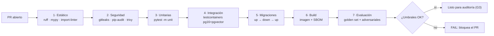

# RFC-0008 — CI/CD, versionado y estrategia de release

| Campo | Valor |
| :--- | :--- |
| **Estado** | Aprobado |
| **Depende de** | RFC-0007, RFC-0009 |
| **Fecha** | 2026-08-22 |

---

## 1. Contexto y problema

El proceso ADU define gates humanos (o de agente). El pipeline es lo que hace esos gates
**inevitables**: sin él, "el auditor lo revisó" es una afirmación no verificable. Además, la
promoción de una imagen entre entornos debe garantizar que lo que se prueba en QA es
exactamente lo que corre en PROD (RNF-10).

## 2. Alcance

**Entra:** ramas, convención de commits, jobs de CI, construcción y promoción de la imagen,
despliegue a QA y a PROD, migraciones, versionado, reversión y gestión de secretos del pipeline.

**No entra:** el contenido de las evaluaciones (RFC-0009), la infraestructura (RFC-0007).

## 3. Ramas y versionado

- `main` es siempre desplegable. Protegida: sin push directo, sin *force push*.
- Rama por RFC: `feat/rfc-000N-<slug>`. Correcciones: `fix/<slug>`.
- Commits: `<tipo>(<ámbito>): <descripción> [RFC-000N]` (Conventional Commits + traza al RFC).
- Versionado semántico por etiqueta `vX.Y.Z`:
  - `MAJOR`: cambio incompatible del contrato de la API.
  - `MINOR`: nueva capacidad compatible (nuevo endpoint, nueva herramienta del agente).
  - `PATCH`: corrección, cambio de prompt sin cambio de contrato, ajuste de infraestructura.
- **Un cambio del prompt de sistema o del `model_id` es siempre al menos `PATCH` y exige nota
  en el changelog**, porque cambia el comportamiento observable aunque no cambie el código.

## 3.1 Configuración del repositorio en GitHub

El proceso ADU define gates humanos (o de agente). La configuración de GitHub es lo que los hace
**inevitables**: sin ella, "el auditor lo revisó" es una afirmación no verificable.

### Protección de la rama `main`

| Ajuste | Valor | Por qué |
| :--- | :--- | :--- |
| Require a pull request before merging | Sí, 1 aprobación | El gate G4 (auditoría) se materializa aquí |
| Require status checks to pass | Jobs 0–7 (§4 y §4.1) | Ningún merge con el pipeline en rojo |
| Require branches to be up to date | Sí | Evita el verde que se rompe al fusionar |
| Require conversation resolution | Sí | Ningún hallazgo del Auditor queda sin cerrar |
| **Allow squash merging** | **No** | El historial del PR es la evidencia de TDD (RFC-0014 §6.1); aplastarlo la destruye |
| Allow merge commits | Sí | Preserva el orden test → implementación |
| Allow force pushes / deletions | No | El historial auditado no se reescribe |
| Require signed commits | Recomendado | Trazabilidad de autoría entre modelos y persona |
| Require linear history | No | Incompatible con conservar el historial del PR |

La prohibición del *squash* es la más contraintuitiva y la más importante: es lo único que
mantiene verificable la comprobación TDD-1 del Auditor.

### Archivos de gobierno del repositorio

| Archivo | Contenido |
| :--- | :--- |
| `.github/pull_request_template.md` | El **Informe de Implementación** completo (RFC-0014 §3 del prompt del Desarrollador) como plantilla, con el mapa criterio → test |
| `.github/ISSUE_TEMPLATE/rfc.md` | Propuesta de RFC nuevo, con los siete puntos del Definition of Ready |
| `.github/ISSUE_TEMPLATE/hallazgo.md` | Hallazgo de auditoría escalado, con severidad y cláusula citada |
| `.github/CODEOWNERS` | `docs/` requiere revisión; `infra/` y `migrations/` también |
| `.github/dependabot.yml` | Actualizaciones de `pip` y `github-actions`, agrupadas, semanales |
| `.github/workflows/ci.yml` | Jobs 0–7 |
| `.github/workflows/deploy-qa.yml` | Despliegue automático al fusionar en `main` |
| `.github/workflows/promote-prod.yml` | Promoción manual con entorno protegido |
| `.github/workflows/nightly.yml` | Suite `full` + mutación (RFC-0014 §6.3) + deriva de Terraform |

### Etiquetas y trazabilidad

- Una etiqueta por RFC en curso: `rfc-0012`, `rfc-0013`… El PR la lleva y el issue del RFC
  también, de modo que el trabajo de un RFC es una consulta, no una búsqueda.
- Etiquetas de proceso: `gate:g3-entregado`, `gate:g4-auditando`, `veredicto:fail`.
- Los informes de auditoría con veredicto `FAIL` se archivan en `docs/auditorias/`
  (ADU-PROCESO §9).

### Entornos de GitHub

| Entorno | Protección | Secretos |
| :--- | :--- | :--- |
| `ci` | Ninguna | `AWS_ROLE_CI` (OIDC, `bedrock:InvokeModel` sobre los ARN de generación y embeddings). Ninguna clave de proveedor con la configuración por defecto |
| `qa` | Solo desde `main` | `QA_HOST`, `QA_USER`, `QA_SSH_KEY` |
| `prod` | **Revisión manual obligatoria** | `AWS_ROLE_TO_ASSUME` (OIDC, sin claves de larga vida) |

La revisión manual del entorno `prod` **es** el gate G6, materializado en la herramienta en vez
de en una costumbre.

## 4. Pipeline de CI (en cada PR)



| # | Job | Falla si | Duración objetivo |
| :--- | :--- | :--- | :--- |
| 1 | `ruff check`, `ruff format --check`, `mypy --strict app/`, `lint-imports` | Cualquier error | < 1 min |
| 2 | `gitleaks detect`, `pip-audit`, `trivy image` (severidad ≥ HIGH) | Secreto detectado o CVE alta sin excepción firmada | < 2 min |
| 3 | `pytest -m "unit" --cov=app --cov-fail-under=80` | Cobertura < 80 % o test rojo | < 2 min |
| 4 | `pytest -m "integration"` con Postgres efímero (`TEST_DB_MODE=container`) | Test rojo | < 5 min |
| 5 | `alembic upgrade head && alembic downgrade base && alembic upgrade head` | Cualquier error | < 2 min |
| 6 | `docker build` multi-etapa + SBOM (`syft`) | Fallo de build | < 3 min |
| 7 | `python evals/run_eval.py --suite pr` (subconjunto de 25 preguntas + adversariales) | Métrica bajo umbral (RFC-0009 §6) | < 6 min |
| 8 | `check-tdd`: el historial del PR tiene un commit `test(...)` antes de cada `feat(...)`, y el PR no viene aplastado | Falta el orden o el historial está aplastado | < 30 s |

El job 8 automatiza la comprobación TDD-1 del Auditor (RFC-0014 §6.1). Las comprobaciones TDD-2
(rojo registrado en CI) y TDD-3 (reversión) siguen siendo del Auditor: la primera se lee del
historial de ejecuciones y la segunda no se puede automatizar sin decidir qué revertir.

### 4.1 Jobs derivados del entorno de desarrollo Windows

DEV es Windows nativo y sin Docker (RFC-0011). Eso desplaza al CI dos verificaciones que en
otro proyecto ocurrirían en la máquina de quien desarrolla, y añade una tercera para proteger
el camino inverso.

| # | Job | Runner | Falla si | Por qué existe |
| :--- | :--- | :--- | :--- | :--- |
| 0 | `check-eol`: `file` sobre `**/*.sh` y `Dockerfile`; `git ls-files --eol` | `ubuntu-latest` | Algún archivo de shell tiene CRLF | Un `.sh` con CRLF muere en el VPS con `bad interpreter: ^M` |
| 3b | `pytest -m unit` | **`windows-latest`** | Test rojo en Windows | Protege el entorno de desarrollo: una dependencia o un `import` que rompa en Windows se detecta en el PR, no al día siguiente |
| 6b | `smoke-image`: levanta el contenedor recién construido con un Postgres de servicio y verifica `/readyz` | `ubuntu-latest` | El contenedor no arranca o `/readyz` no responde | DEV no puede construir ni ejecutar la imagen; sin este job, un `Dockerfile` roto llegaría a QA |

Los jobs 4 y 6 corren **solo en Linux**: `testcontainers` necesita Docker y el runner de
Windows no lo tiene configurado por defecto. La suite de integración es idéntica en ambos
sitios; lo único que cambia es `TEST_DB_MODE` (RFC-0011 §8).

**El job 7 usa Bedrock real** y es el único con costo por ejecución (≈ USD 0.30 por PR). Es un
coste asumido a conciencia: sin evaluación real, el gate de calidad es decorativo. Se ejecuta
solo cuando los jobs 1–6 están en verde, para no pagar por PRs que no compilan.

## 5. Construcción de la imagen

```dockerfile
FROM python:3.12-slim AS builder
ENV PIP_NO_CACHE_DIR=1 PYTHONDONTWRITEBYTECODE=1
WORKDIR /build
RUN pip install --no-cache-dir uv
COPY pyproject.toml uv.lock ./
RUN uv export --frozen --no-dev -o requirements.txt \
 && pip install --no-cache-dir --prefix=/install -r requirements.txt

FROM python:3.12-slim AS runtime
RUN groupadd -r app && useradd -r -g app app
COPY --from=builder /install /usr/local
WORKDIR /app
COPY app/ ./app/
COPY corpus/ ./corpus/
COPY migrations/ ./migrations/
COPY alembic.ini ./
USER app
EXPOSE 8080
HEALTHCHECK --interval=30s --timeout=3s --start-period=20s \
  CMD python -c "import urllib.request,sys; sys.exit(0 if urllib.request.urlopen('http://127.0.0.1:8080/healthz').status==200 else 1)"
CMD ["uvicorn", "app.main:app", "--host", "0.0.0.0", "--port", "8080", "--workers", "2"]
```

Decisiones respecto al `Dockerfile` del documento base:

| Cambio | Motivo |
| :--- | :--- |
| Multi-etapa | La imagen final no lleva compiladores ni caché de pip: menos superficie y menos peso |
| `USER app` (no root) | App Runner y cualquier auditoría de contenedores lo exigen |
| `COPY app/ corpus/ migrations/` en vez de `COPY . .` | Evita meter `.env`, `.git`, tests y notebooks en la imagen |
| `HEALTHCHECK` | Permite al orquestador detectar un proceso vivo pero inservible |
| Dependencias con *lock* (`uv.lock`) | Reproducibilidad: sin lock, dos builds del mismo commit pueden diferir |

**La imagen solo se construye en el CI.** DEV no tiene Docker, así que el `Dockerfile` no
tiene ningún camino de validación local: el job 6 (build) y el 6b (humo del contenedor) son
la primera y única verificación antes de QA. Por eso ambos corren pronto en el pipeline y no
al final.

**Etiquetado:** cada imagen se publica con tres etiquetas: `sha-<git-sha>` (inmutable), `qa`
(móvil) y, al promover, `vX.Y.Z` y `prod`. La promoción **no reconstruye**: reetiqueta el mismo
digest.

## 6. Despliegue a QA (automático al fusionar en `main`)

```yaml
# fragmento de .github/workflows/deploy-qa.yml
- name: Push a GHCR
  run: docker push ghcr.io/<org>/rag-cv:sha-${{ github.sha }}

- name: Desplegar en el VPS
  uses: appleboy/ssh-action@v1
  with:
    host: ${{ secrets.QA_HOST }}
    username: ${{ secrets.QA_USER }}
    key: ${{ secrets.QA_SSH_KEY }}
    script: |
      set -euo pipefail
      cd /opt/rag-cv
      export IMAGE_TAG=sha-${{ github.sha }}
      docker compose pull api
      docker compose run --rm api alembic upgrade head
      docker compose up -d api
      timeout 90 bash -c 'until curl -fsS https://qa.<dominio>/readyz; do sleep 3; done'
      docker compose run --rm api python -m app.ingestion.indexer --corpus corpus/cv.md

- name: Humo + evaluación en QA
  run: python evals/run_eval.py --suite qa --base-url https://qa.<dominio>
```

Si el humo o la evaluación fallan, el job vuelve a la etiqueta anterior
(`docker compose up -d` con el `IMAGE_TAG` previo, guardado en `/opt/rag-cv/.last_good`) y
marca el despliegue como fallido.

## 7. Promoción a PROD (manual, gate G6)

Disparo manual (`workflow_dispatch`) con el `git_sha` a promover. El pipeline:

1. Verifica que ese SHA **está desplegado en QA y su evaluación pasó** (consulta el registro de
   despliegues). Si no, aborta.
2. Reetiqueta el digest en ECR como `vX.Y.Z` y `prod` (sin reconstruir).
3. Crea un *snapshot* manual de RDS.
4. Ejecuta `alembic upgrade head` como tarea puntual contra RDS (job efímero de ECS o sesión
   con `psql` desde el runner con acceso; **nunca desde el arranque de la aplicación**).
5. Actualiza el servicio de App Runner al nuevo digest. App Runner hace despliegue progresivo:
   levanta la revisión nueva, la somete al health check `/readyz` y solo entonces retira la
   anterior.
6. Espera a `OPERATION_STATUS = SUCCEEDED` y ejecuta el humo contra el dominio de producción.
7. Ejecuta `evals/run_eval.py --suite prod-smoke` (8 preguntas, coste ≈ USD 0.05).
8. Publica la nota de versión y etiqueta el repositorio.

Cualquier paso fallido detiene el proceso y ejecuta la reversión de §8.

## 8. Reversión

| Escenario | Acción | Tiempo objetivo |
| :--- | :--- | :--- |
| La revisión nueva no pasa el health check | App Runner mantiene la anterior automáticamente | Inmediato |
| Fallo detectado tras el despliegue, **sin** migración | `aws apprunner update-service` al digest anterior | < 5 min |
| Fallo detectado tras el despliegue, **con** migración compatible | Igual que el anterior: la migración es compatible hacia atrás por diseño (*expand & contract*, RFC-0006 §5) | < 5 min |
| Fallo con migración incompatible | Restaurar el *snapshot* previo + desplegar el digest anterior | < 45 min |
| Corpus mal indexado | `POST /v1/admin/reindex` con el corpus del commit anterior | < 5 min |

El caso "migración incompatible" es lento a propósito: la regla de *expand & contract* existe
justamente para que nunca ocurra. Si el equipo se encuentra ahí, es un fallo de diseño de la
migración, y así se registra en la retrospectiva.

## 9. Secretos del pipeline

| Secreto | Dónde | Uso |
| :--- | :--- | :--- |
| `QA_HOST`, `QA_USER`, `QA_SSH_KEY` | GitHub Environments (`qa`) | Despliegue por SSH |
| `AWS_ROLE_TO_ASSUME` | GitHub Environments (`prod`) | **OIDC**: el runner asume un rol; no hay claves de larga vida en GitHub |
| `EVAL_AWS_ROLE` | Environment `ci` | Rol OIDC con `bedrock:InvokeModel` sobre los ARN de generación y de embeddings, para los jobs de calidad y evaluación. Las unitarias usan `FakeEmbedder` y no lo consumen |
| Clave del proveedor de generación | Environment `ci` | **Solo si `PROVEEDOR` no es `bedrock`.** Con la configuración por defecto no hay ninguna: el rol OIDC cubre generación y embeddings |

El entorno `prod` de GitHub exige **revisión manual obligatoria** antes de ejecutar: es el gate
G6 materializado en la herramienta.

## 10. Criterios de aceptación

| # | Criterio | Verificación |
| :--- | :--- | :--- |
| CA-1 | Un PR con `ruff` en rojo no puede fusionarse | Comprobación de rama protegida |
| CA-1b | Un PR con un `.sh` en CRLF es bloqueado por el job 0 | PR de prueba controlado |
| CA-1c | Un PR que rompe las unitarias solo en Windows es bloqueado por el job 3b | PR de prueba controlado |
| CA-2 | Un PR con un secreto de prueba es bloqueado por `gitleaks` | PR de prueba controlado |
| CA-3 | Un PR que baja la cobertura por debajo de 80 % falla | PR de prueba |
| CA-4 | Un PR que degrada *groundedness* por debajo del umbral falla en el job 7 | PR con prompt saboteado |
| CA-5 | La imagen de PROD tiene el mismo digest que la validada en QA | Comparar digests tras una promoción |
| CA-6 | La imagen no corre como root y no contiene `.env` ni `.git` | `docker run --rm img id` + `docker history` |
| CA-7 | La promoción a PROD aborta si el SHA no pasó por QA | Ejecución de prueba con un SHA arbitrario |
| CA-8 | La reversión al digest anterior deja el servicio sano en < 5 min | Simulacro documentado en el runbook |
| CA-9 | El despliegue a PROD usa OIDC, sin claves de AWS en GitHub | Revisión de la configuración del workflow |
| CA-10 | Las migraciones se ejecutan como paso del pipeline, nunca en el arranque | Revisión del workflow y del `lifespan` |

## 11. Riesgos

| Riesgo | Mitigación |
| :--- | :--- |
| El job de evaluación encarece cada PR | Suite reducida en PR (25 preguntas), completa solo en `main` |
| Bedrock con *throttling* durante la evaluación de CI | Reintentos + ejecución secuencial + fallo distinguido de "métrica baja" |
| Despliegue a QA roto deja QA inservible para el equipo | Reversión automática a `.last_good` |
| Deriva entre lo desplegado y `main` | Job programado que compara el digest en ejecución con el último de `main` |
| El `Dockerfile` se rompe y nadie lo ve hasta QA | Jobs 6 y 6b tempranos y obligatorios (§4.1) |
| Los runners de Windows alargan el tiempo de CI | El job 3b solo ejecuta unitarias y corre en paralelo con el resto |

## Contrato de auditoría (gate ADU)

| # | Comprobación | Cómo se verifica | Severidad si falla |
| :--- | :--- | :--- | :--- |
| A-1 | `main` está protegida y exige los jobs 1–7 en verde | Configuración del repositorio | Bloqueante |
| A-2 | La imagen de PROD es el mismo digest validado en QA (no se reconstruye) | CA-5 | Bloqueante |
| A-3 | El contenedor no corre como root ni incluye archivos fuera de §5 | CA-6 | Mayor |
| A-4 | Existe `uv.lock` (o equivalente) y el build lo usa | Lectura del `Dockerfile` | Mayor |
| A-5 | No hay claves de AWS de larga vida en el pipeline; se usa OIDC | CA-9 | Bloqueante |
| A-6 | El gate de evaluación bloquea de verdad (probado con un PR saboteado) | CA-4 | Bloqueante |
| A-7 | El entorno `prod` de GitHub exige aprobación manual | Configuración de Environments | Mayor |
| A-8 | Existe procedimiento de reversión probado y documentado | CA-8 + runbook | Mayor |
| A-9 | Las migraciones no corren en el arranque de la aplicación | CA-10 | Bloqueante |
| A-10 | Cada imagen lleva etiqueta `sha-<git-sha>` inmutable | Inspección de ECR/GHCR | Menor |
| A-11 | Existen los jobs 0, 3b y 6b de §4.1 y son obligatorios para el merge | Lectura del workflow y de la protección de rama | Mayor |
| A-12 | El CI invoca las tareas vía `invoke`, no comandos duplicados respecto a `tasks.py` | Comparación workflow ↔ `tasks.py` | Menor |
