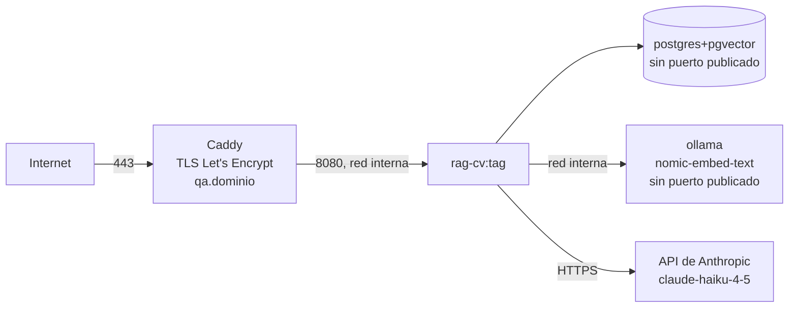

# RFC-0016 — Alcance de la PoC y entrega en QA (VPS Ubuntu)

| Campo | Valor |
| :--- | :--- |
| **Estado** | Aprobado |
| **Depende de** | RFC-0007, RFC-0008, RFC-0015 |
| **Supersede** | RFC-0007 §6, §7, §9, §10 (para el alcance de la PoC); RFC-0015 §8 y la fila QA de §9; RFC-0001 §topología de despliegue. *(RFC-0007 §5.2 lo deroga RFC-0018, no este RFC)* |
| **ADRs** | ADR-0006 |
| **Fecha** | 2026-08-22 |

---

## 1. Contexto y problema

El corpus documental describe un sistema de tres entornos cuyo destino final es AWS. ADR-0006
redujo el alcance: **la PoC se entrega en QA —un VPS Ubuntu— y AWS queda diferido.**

El problema que resuelve este RFC no es técnico, es de **lectura**. Quince RFCs aprobados
mencionan App Runner, RDS, Terraform, Secrets Manager y CloudWatch. Ninguno se edita: la
convención del proyecto (`docs/README.md` §5) es que un RFC aprobado se supersede, no se toca. Sin
un documento que declare qué sigue vigente y qué no, cualquiera que abra el repositorio no puede
distinguir **diseño diferido** de **diseño obsoleto**, y esa ambigüedad es peor que no haber
reducido el alcance.

Este RFC es ese documento: la capa que se lee **junto a** los demás para saber qué se ejecuta hoy.

> **Regla de lectura.** Un RFC marcado `Diferido` aquí **no está obsoleto ni derogado**: es
> diseño aprobado cuya ejecución se pospone. El día que se cierre ADR-0006, vuelve a ser
> normativo sin haber sido reescrito.

## 2. Alcance

**Entra:** la clasificación de todo el corpus documental frente a la PoC, la topología de
ejecución, el dimensionado del VPS, la re-lectura de los requisitos no funcionales, la
configuración consolidada y el procedimiento de despliegue y de promoción futura.

**No entra:** el modelo de embeddings (RFC-0017), el proveedor de generación (RFC-0018), la
topología de QA en sí —que RFC-0007 §5 ya especifica y este RFC no repite—, ni el diseño de PROD,
que permanece intacto en RFC-0007 §6.

## 3. Clasificación del corpus documental

Tres estados, y solo tres:

- **Vigente** — se ejecuta tal como está escrito.
- **Vigente con delta** — se ejecuta leído junto al RFC que se indica, que modifica una parte
  acotada. El original no se edita.
- **Diferido** — diseño aprobado que no se ejecuta en la PoC. No se edita, no se marca obsoleto.

### 3.1 RFCs

| RFC | Estado en la PoC | Delta / motivo |
| :--- | :--- | :--- |
| RFC-0001 Arquitectura general | Vigente con delta | La topología de despliegue y las filas de generación y embeddings se leen junto a este RFC, RFC-0017 y RFC-0018 |
| RFC-0002 Ingesta y chunking | Vigente con delta | El troceado y la normalización no cambian; la **fuente** del corpus sí (§3.3) |
| RFC-0003 Retrieval híbrido (HNSW + FTS + RRF) | **Vigente** | La degradación a rama léxica de §6 pasa a cubrir la caída del embedder local en vez de la de Bedrock |
| RFC-0004 Capa de agente Strands | Vigente con delta | La construcción del modelo ya la delegaba en RFC-0013; ahora se lee junto a RFC-0018 |
| RFC-0005 API REST y autenticación | **Vigente** | Sin cambios |
| RFC-0006 Modelo de datos y migraciones | Vigente con delta | `VECTOR(1024)` → `VECTOR(768)` y recreación del HNSW (RFC-0017 §4) |
| RFC-0007 Entornos e infraestructura | Parcial | §3, §4 y §5 **vigentes** (salvo §5.2). §5.2 (credenciales AWS en QA) **derogado** por RFC-0018. §6 (PROD), §7 (IAM), §9 (IaC) y §10 (costos AWS) **diferidos** |
| RFC-0008 CI/CD y release | Vigente con delta | El pipeline construye, prueba y despliega **hasta QA**. El paso de promoción a PROD por digest queda diferido; el job de deriva de Terraform no aplica |
| RFC-0009 Evaluación y guardrails | **Vigente** | Es el gate que decide la variante de embedder de ADR-0007. Sus umbrales no se relajan |
| RFC-0010 Observabilidad, costos y runbook | Vigente con delta | Logs JSON + rotación en el VPS **vigentes**. CloudWatch, las diez alarmas de §6 y el presupuesto de PROD, **diferidos**. El runbook mantiene §9.6c (reindexación), que este cambio ejercita |
| RFC-0011 Entorno DEV Windows nativo | Vigente con delta | Deja de necesitar `aws sso login` y salida a internet para indexar: el embedder es local (RFC-0017 §6) |
| RFC-0012 Capa de embeddings enchufable | Vigente con delta | La **interfaz, el contrato y la suite de pruebas siguen intactos**. Cambia la implementación por defecto: RFC-0017 |
| RFC-0013 Capa de proveedores LLM | Vigente con delta | La **fábrica y la parametrización siguen intactas**. Cambia el proveedor designado: RFC-0018 |
| RFC-0014 Disciplina TDD | **Vigente** | Sin cambios. Aplica a todo lo que se implemente bajo este alcance |
| RFC-0015 Empaquetado Docker y despliegue | Parcial | §1–§7 y §10 **vigentes**. §8 (`docker-compose.prod.yml`) **diferido**. La fila QA de §9 se sustituye por §5 de este RFC |

**Los RFCs de AWS no se han tocado.** RFC-0007 §6, §7, §9 y §10 y RFC-0015 §8 conservan su
redacción original, palabra por palabra.

### 3.2 ADRs

| ADR | Estado en la PoC |
| :--- | :--- |
| ADR-0001 App Runner como cómputo de PROD | **Diferido** — sigue siendo la decisión de PROD; PROD sale del alcance |
| ADR-0002 pgvector propio en vez de Bedrock Knowledge Bases | **Vigente** — y ahora más: es lo que permite que el retrieval no dependa de AWS |
| ADR-0003 Strands Agents sobre boto3 directo | **Vigente** |
| ADR-0004 Titan V2 por defecto | **Sustituido en la PoC** por ADR-0007; sigue vigente para el camino AWS diferido |
| ADR-0005 Proveedor de generación por parametrización | **Vigente** — su designación inicial la modifica ADR-0008 |

### 3.3 Fuente del corpus — la consecuencia menos evidente

Sin AWS no hay bucket. `README.md` describe **S3 como fuente autoritativa del CV** con eventos de
EventBridge, worker dedicado, DLQ y job de reconciliación, y el DDL vigente lo materializa:

```sql
-- infra/sql/001_initialize_rag_cv.sql
object_key      text NOT NULL,
s3_version_id   text NOT NULL,
s3_etag         text NOT NULL,
CONSTRAINT source_documents_object_version_key UNIQUE (object_key, s3_version_id),
```

`s3_version_id` es `NOT NULL` y participa en dos claves únicas y en claves foráneas compuestas
hacia `ingestion_jobs`. **Es la dependencia de AWS más profunda del proyecto**, porque no está en
la configuración: está en el esquema.

**Decisión para la PoC.** La fuente del corpus es el **fichero local** que RFC-0001 ya
parametriza (`CORPUS_PATH=corpus/cv.md`) y que el despliegue de RFC-0007 §5.3 ya indexa. Los
eventos de S3, el worker y la reconciliación quedan **diferidos** junto con el resto de AWS.

**Las columnas del ledger no se eliminan: se generaliza su semántica.** Pasan de significar
"objeto de S3 y su `VersionId`" a significar "identidad de la fuente y su token de versión
inmutable":

| Columna | Semántica en el camino AWS | Semántica en la PoC |
| :--- | :--- | :--- |
| `object_key` | Clave del objeto en S3 | Ruta del corpus (`corpus/cv.md`) |
| `s3_version_id` | `VersionId` de S3 | Token de versión inmutable de la fuente local |
| `s3_etag` | ETag del objeto | Marcador opaco de la misma fuente |

`content_sha256` sigue siendo **la prueba del cambio real**, como ya declara `README.md`; el token
de versión solo aporta identidad, no equivalencia de contenido.

Por qué generalizar y no borrar: el ledger es lo que da idempotencia y trazabilidad —"qué versión
del CV produjo este índice"—, y esa propiedad **no depende de S3**. Borrar las columnas obligaría
a una migración destructiva ahora y a reconstruirlas al volver a AWS. Mantenerlas conserva el
camino de promoción de ADR-0006 intacto.

**El token de versión es el SHA de commit de git que produjo `corpus/cv.md`.** Dentro del
contenedor, donde no hay checkout, se usa el commit con el que se construyó la imagen, que
RFC-0015 §4 ya estampa como metadato de trazabilidad.

Y **no** es el `content_sha256`, aunque sea lo primero que uno piensa. El DDL retiró
deliberadamente la unicidad de `(object_key, content_sha256)`:

```sql
-- Earlier bootstrap drafts made (object_key, content_sha256) unique. Retire that...
```

Si el token de versión fuera el hash del contenido, `UNIQUE (object_key, s3_version_id)` volvería
a imponer esa misma restricción por la puerta de atrás, y reindexar un CV sin cambios pasaría de
ser **trabajo idempotente** a ser una **violación de unicidad**. Es decir: el despliegue de
RFC-0007 §5.3, que indexa en cada release, fallaría en el segundo despliegue sin cambios de
corpus.

El commit no tiene ese problema: cambia en cada revisión aunque el contenido sea idéntico, así
que la fila nueva del ledger entra, `content_sha256` coincide con la anterior y la ingesta se
resuelve como idempotente sin regenerar embeddings — que es exactamente el comportamiento que
`README.md` describe.

**Los nombres de columna no se renombran en la PoC.** Un renombrado toca dos claves únicas y dos
claves foráneas compuestas sobre un esquema ya desplegado, a cambio de nada funcional. Se hace, si
se hace, al cerrar ADR-0006.

## 4. Topología de ejecución de la PoC



Frente a RFC-0007 §5.1 cambian dos cosas y solo dos: **aparece `ollama` como cuarto servicio del
compose**, y **la flecha hacia Bedrock pasa a apuntar a la API de Anthropic**. El resto —Caddy
como único puerto abierto junto a SSH, `ufw` a 22/80/443, `fail2ban`, SSH solo por clave, base de
datos sin puerto publicado— se ejecuta tal como está escrito allí.

`ollama` **no publica puertos**: igual que la base de datos, solo es alcanzable por nombre de
servicio dentro de la red del compose. Un servicio de inferencia expuesto a internet sin
autenticación es una cuenta ajena corriendo en tu VPS.

## 5. Dimensionamiento del VPS

Mientras los embeddings eran una llamada a Bedrock, el tamaño del VPS era un detalle de compra:
no había modelo en memoria (así lo justificaba RFC-0015 §9). Al autoalojar el embedder deja de
serlo. **Este es el requisito de infraestructura de la PoC y no estaba declarado en ningún
documento anterior.**

| Componente | Memoria estimada | Nota |
| :--- | :--- | :--- |
| Sistema operativo (Ubuntu 24.04, sin escritorio) | ~400 MB | — |
| Caddy | ~30 MB | — |
| API (`uvicorn`, 2 *workers*) | ~350 MB | ~180 MB por proceso (RFC-0012 §8) |
| PostgreSQL 16 + pgvector | ~400 MB | Corpus diminuto; domina `shared_buffers` |
| Ollama + `nomic-embed-text` v1.5 (F16) | ~550 MB | ~274 MB de pesos + tiempo de ejecución |
| Ollama + variante multilingüe `v2-moe` (F16) | ~1.4 GB | Modelo mayor: es el caso que dimensiona |

**Requisito: 2 vCPU y ≥ 4 GB de RAM; recomendado 8 GB.** El caso que manda es el multilingüe
(≈ 2.6 GB en reposo), y hay que dejar margen para la caché de páginas de PostgreSQL y para las
corridas de evaluación, que consultan en ráfaga.

Estas cifras son **estimaciones y se verifican en el VPS real** (CA-4). Un `docker compose` que
arranca y muere por OOM al primer lote de indexación es el modo de fallo esperable si el VPS se
queda en 1 GB, y por eso el número entra como criterio de aceptación y no como comentario.

## 6. Re-lectura de los requisitos no funcionales

Reducir el alcance obliga a declarar qué se sigue midiendo y qué **deja de verificarse**. Dar por
cumplido un umbral que ya no se mide sería el peor resultado de este RFC.

| RNF | Estado en la PoC | Motivo |
| :--- | :--- | :--- |
| RNF-1, RNF-2, RNF-3 (latencias) | **Se miden**, en QA | La evaluación de RFC-0009 las registra en su propia ejecución |
| RNF-4 (disponibilidad ≥ 99.5 %) | **No verificado** | Un host único no tiene alta disponibilidad. Se declara no verificado, no cumplido |
| RNF-5 (costo por conversación ≤ USD 0.05) | **Se mide** | De `usage.cost_usd`; ahora es el único freno de coste (ADR-0008) |
| RNF-6 (costo de PROD ≤ USD 60/mes) | **No aplica** | No hay PROD. El costo de la PoC es el del VPS, fijo |
| RNF-7 (la BD nunca se expone a internet) | **Se cumple** | RFC-0007 §5.1 ya lo aplicaba a QA. Se extiende a `ollama` (§4) |
| RNF-8 (secretos fuera del repositorio) | **Se cumple** | `ANTHROPIC_API_KEY` en `/opt/rag-cv/.env` con permisos `600` |
| RNF-9 (límite de tasa por API Key) | **Se cumple** | Sin cambios (RFC-0005) |
| RNF-10 (imagen construida una vez, promovida por digest) | **Se cumple parcialmente** | La imagen se construye una vez en el CI y se despliega a QA por digest. El tramo QA → PROD queda diferido |
| RNF-11 (independencia del sistema operativo) | **Se cumple** | Sin cambios: el CI en Linux sigue siendo la autoridad |
| RNF-12 (vectores comparables entre entornos) | **Se cumple**, y mejor | DEV y QA corren el mismo modelo fijado por *digest*, sin dos caminos de servicio (RFC-0017 §6) |
| RNF-13 (cambiar de modelo sin tocar código) | **Se demuestra** | Este cambio de alcance es su verificación: se cambian embedder y proveedor por configuración |

## 7. Configuración consolidada de la PoC

Las variables las definen RFC-0012, RFC-0013 y RFC-0007; aquí solo se fija **el valor vigente**
para no obligar a reconstruir la configuración leyendo cinco documentos.

| Variable | Valor en la PoC | Origen |
| :--- | :--- | :--- |
| `APP_ENV` | `qa` | RFC-0007 |
| `EMBEDDER` | `ollama` | RFC-0017 |
| `EMBEDDING_DIM` | `768` | RFC-0017 |
| `OLLAMA_BASE_URL` | `http://ollama:11434` | RFC-0017 — nombre de servicio del compose |
| `PROVEEDOR` | `anthropic` | RFC-0018 |
| `ANTHROPIC_MODEL_ID` | `claude-haiku-4-5` | RFC-0018 |
| `ANTHROPIC_API_KEY` | secreto, `.env` con permisos `600` | RFC-0018 |
| `AWS_REGION`, `BEDROCK_MODEL_ID`, `TITAN_MODEL_ID` | **ausentes** | Sin uso en la PoC |

Que las variables de AWS estén **ausentes y no vacías** es deliberado: `Settings` valida por rama
(RFC-0012 §5, RFC-0013 §5), y una variable presente con valor vacío es la forma habitual de que un
despliegue arranque a medias en lugar de fallar de inmediato.

## 8. Despliegue y promoción futura

El despliegue en QA es el de RFC-0007 §5.3, con dos añadidos:

```bash
# aprovisionamiento, una sola vez por VPS
docker compose -f /opt/rag-cv/docker-compose.qa.yml up -d ollama
docker compose -f /opt/rag-cv/docker-compose.qa.yml exec ollama \
    ollama pull <modelo-fijado-por-digest>        # RFC-0017 §5

# despliegue, en cada release (RFC-0007 §5.3, sin cambios)
docker compose -f /opt/rag-cv/docker-compose.qa.yml pull api
docker compose -f /opt/rag-cv/docker-compose.qa.yml run --rm api alembic upgrade head
docker compose -f /opt/rag-cv/docker-compose.qa.yml up -d api
docker compose -f /opt/rag-cv/docker-compose.qa.yml run --rm api \
    python -m app.ingestion.indexer --corpus corpus/cv.md
curl -fsS https://qa.<dominio>/readyz
```

**El `pull` del modelo es un paso de aprovisionamiento, no de despliegue.** Si se omite, el primer
arranque falla en la comprobación 4c de RFC-0012 §7 (`/readyz` en rojo) — un fallo correcto, pero
que solo se entiende si el paso está escrito.

**Promoción futura a PROD.** El artefacto no cambia: es la misma imagen. Cerrar ADR-0006 significa
reactivar RFC-0007 §6, §7, §9 y RFC-0015 §8 tal como están, y decidir entonces si los modelos
vuelven a Bedrock (ADR-0004, ADR-0005 recuperan vigencia) o se mantienen los de la PoC. Esa
decisión es del Arquitecto y no se anticipa aquí.

## 9. Fallos y degradación

| Fallo | Detección | Comportamiento |
| :--- | :--- | :--- |
| `ollama` no responde | `/readyz`, comprobación 4c de RFC-0012 §7 | Consulta: degrada a **solo rama léxica** con `degraded=true` (RFC-0003 §6). Indexación: `rollback` completo |
| Modelo no descargado en el VPS | Primer arranque | `/readyz` en rojo con el nombre del modelo esperado. No arranca a medias |
| OOM del host | Cierre del contenedor por el kernel | Es el modo de fallo del VPS infradimensionado (§5). Se contiene con el requisito de memoria y su verificación |
| API de Anthropic caída o con error de cuota | Cliente del proveedor | RFC-0013 §7: reintentos y fallo explícito. El *fallback* sigue apagado por defecto (ADR-0005) |
| El VPS cae | Sonda externa | **No hay servicio.** Punto único de fallo aceptado en ADR-0006 |

La diferencia importante frente al diseño anterior: la caída del embedder ya **no** coincide con
la caída del generador. Antes ambos eran Bedrock y una incidencia regional se llevaba los dos;
ahora son un contenedor local y una API externa, y la degradación a rama léxica cubre el primero
sin tocar el segundo.

## 10. Criterios de aceptación

| # | Criterio | Verificación |
| :--- | :--- | :--- |
| CA-1 | El `docker compose` de QA levanta cuatro servicios (`caddy`, `api`, `db`, `ollama`) y solo `caddy` publica puertos | `docker compose config` + `ss -ltnp` en el VPS |
| CA-2 | La aplicación arranca y sirve `/readyz` en verde **sin ninguna credencial de AWS presente** en el entorno | Despliegue con `env` sin variables `AWS_*` |
| CA-3 | No queda ninguna referencia a `bedrock`, `titan` ni `AWS_REGION` en la configuración efectiva de la PoC | `docker compose exec api env` + lectura del `.env` |
| CA-4 | El host sostiene el conjunto en reposo y durante una indexación completa sin OOM, con la variante de embedder elegida | `docker stats` y `free -m` durante `python -m app.ingestion.indexer` |
| CA-5 | La suite de evaluación de RFC-0009 se ejecuta completa contra QA y publica sus métricas | `invoke evals --suite full` contra el despliegue de QA |
| CA-6 | El pipeline de RFC-0008 llega hasta QA y no intenta ningún paso de AWS | Ejecución del workflow en verde |
| CA-7 | RNF-4 y RNF-6 aparecen declarados **no verificados** en el informe de la PoC, no como cumplidos | Lectura del informe |
| CA-8 | Los RFCs y ADRs marcados `Diferido` conservan su contenido sin modificaciones | `git log --follow` sobre RFC-0007 y RFC-0015 |
| CA-9 | Dos despliegues consecutivos sin cambios de corpus no violan unicidad y no regeneran embeddings | Ejecutar `§8` dos veces seguidas contra el mismo commit y contra un commit nuevo sin cambios en `cv.md` |
| CA-10 | El token de versión persistido es el SHA de commit, **no** el `content_sha256` | Consulta a `source_documents` tras dos ingestas |

## 11. Riesgos

| Riesgo | Mitigación |
| :--- | :--- |
| Alguien lee un RFC diferido y lo implementa creyéndolo vigente | §3 es la fuente única de estado; `docs/README.md` lo refleja en su índice |
| Se declara RNF-4 cumplido porque "en QA no se cayó" | CA-7 lo convierte en comprobación auditable |
| El VPS se queda corto de memoria a mitad de la demo | §5 con número, CA-4, y la variante multilingüe como caso de dimensionado |
| `Diferido` se lee como `Obsoleto` y alguien borra el diseño de AWS | Regla de lectura explícita en §1 y CA-8 |
| La reducción de alcance se usa para relajar los umbrales de RFC-0009 | RFC-0009 se declara **Vigente** sin delta: los umbrales no se tocan |
| El paso de `ollama pull` se omite en un VPS nuevo | Documentado en §8 y detectado por `/readyz` antes de servir tráfico |

## Contrato de auditoría (gate ADU)

| # | Comprobación | Cómo se verifica | Severidad si falla |
| :--- | :--- | :--- | :--- |
| A-1 | Ningún RFC ni ADR marcado `Diferido` ha sido editado | `git diff` contra el commit previo al cambio de alcance | Bloqueante |
| A-2 | La aplicación arranca y responde sin ninguna variable `AWS_*` en el entorno | CA-2, CA-3 | Bloqueante |
| A-3 | Ni la base de datos ni `ollama` publican puertos al host | CA-1 | Bloqueante |
| A-4 | El requisito de memoria del VPS está declarado con número y verificado en el host real | §5 + CA-4 | Mayor |
| A-5 | RNF-4 y RNF-6 figuran como **no verificados** en el informe de la PoC | CA-7 | Bloqueante |
| A-6 | Los umbrales de RFC-0009 no se han modificado | `git diff` sobre RFC-0009 | Bloqueante |
| A-7 | El índice de `docs/README.md` refleja el estado de cada RFC frente a la PoC | Lectura | Menor |
| A-8 | El token de versión del ledger no es el `content_sha256` | CA-10 | Bloqueante |
| A-9 | Reindexar sin cambios de corpus es idempotente y no falla por unicidad | CA-9 | Bloqueante |
| A-10 | El paso de aprovisionamiento del modelo está en el runbook | Lectura de RFC-0010 §9 | Menor |
