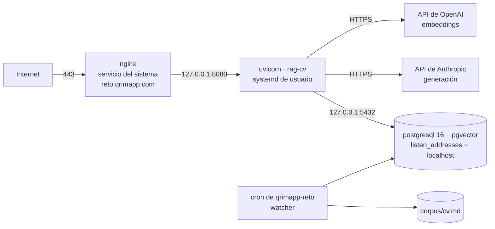

# RFC-0020 — Topología nativa de QA y despliegue por SSH

| Campo | Valor |
| :--- | :--- |
| **Estado** | Aprobado |
| **Depende de** | RFC-0016, RFC-0007, RFC-0008, RFC-0017, RFC-0019 |
| **Supersede** | RFC-0007 §5.1 y §5.3 (topología y despliegue de QA, incluido Caddy como terminador TLS) y RFC-0015 §7 (composición de QA), para el alcance de la PoC |
| **ADRs** | ADR-0010, ADR-0019 |
| **Fecha** | 2026-08-22 |

---

## 1. Contexto y problema

ADR-0010 decidió desplegar QA de forma nativa, sin contenedores. Este RFC es el contrato de esa
topología y del despliegue por SSH.

Lo que **no** cambia, y es la mayor parte del sistema: la aplicación, su arquitectura, el troceado
(RFC-0002), la recuperación híbrida (RFC-0003), la capa de agente (RFC-0004), la API y su
autenticación (RFC-0005), el esquema (RFC-0006), la evaluación (RFC-0009) y la disciplina TDD
(RFC-0014). **Cambia dónde corren los procesos y cómo llega el código, nada más.** Que el cambio
se pueda acotar así es consecuencia de que la configuración ya fuera externa (RNF-13).

Lo que sí desaparece es la propiedad que el contenedor daba: el artefacto portátil. Se sustituye,
no se ignora — §6.

## 2. Alcance

**Entra:** la topología de procesos, el aprovisionamiento con privilegios, la supervisión, el
aislamiento de red, el despliegue por SSH con identidad de release y reversión, y la configuración
que cambia respecto al diseño con contenedores.

**No entra:** el modelo de embeddings (RFC-0017), el proveedor de generación (RFC-0018), el sondeo
del corpus (RFC-0019), el diseño de empaquetado en contenedor (RFC-0015, diferido con PROD).

## 3. Topología



| Proceso | Cómo corre | Quién lo gestiona | Escucha en |
| :--- | :--- | :--- | :--- |
| `nginx` | Servicio del sistema (`systemd`) — **ya instalado en el VPS** | `root`, aprovisionamiento | `0.0.0.0:80`, `0.0.0.0:443` |
| `postgresql` | Servicio del sistema (`systemd`) | `root`, aprovisionamiento | `127.0.0.1:5432` |
| `rag-cv` (uvicorn) | **Unidad de usuario** de `systemd` | `qrimapp-reto` | `127.0.0.1:8080` |
| `watcher` | `crontab` de `qrimapp-reto` (RFC-0019) | `qrimapp-reto` | — |

La división no es arbitraria: **lo que el operador necesita reiniciar en el día a día corre como
unidad de usuario**; lo que solo se toca al aprovisionar corre como servicio del sistema. Es la
misma separación por momento y no por persona que fija RFC-0016 §8.1, aplicada a los procesos.

## 4. Aprovisionamiento — una vez por VPS, con privilegios

```bash
# 1. Paquetes del sistema. nginx YA esta instalado y sirviendo: no se toca,
#    y sobre todo NO se instala Caddy, que competiria por los puertos 80 y 443.
apt-get install -y postgresql-16 postgresql-16-pgvector python3.12-venv

# 2. Base de datos: solo por bucle local
#    postgresql.conf -> listen_addresses = 'localhost'

# 2b. Crear la base CON PROVEEDOR ICU es-MX. No es opcional ni cosmetico:
#     ver la nota de abajo. Debe hacerse ANTES de la primera migracion,
#     porque la configuracion regional se fija al crear la base.
sudo -u postgres createdb ragcv \
  --encoding=UTF8 --locale-provider=icu --icu-locale=es-MX --template=template0
sudo -u postgres psql -d ragcv -c \
  "SELECT datcollate, datlocprovider FROM pg_database WHERE datname = 'ragcv'"

# 3. Cortafuegos: VERIFICAR antes de tocar.
#    Si el VPS trae panel de control, el cortafuegos puede estar gestionado por el:
#    un `ufw enable` a ciegas puede dejarte fuera o romper reglas existentes.
ufw status verbose        # y solo entonces decidir

# 4. Que las unidades de usuario arranquen sin sesión abierta
loginctl enable-linger qrimapp-reto

# 5. Árbol de despliegue, propiedad del operador
install -d -o qrimapp-reto -g qrimapp-reto /opt/rag-cv/{releases,corpus,logs}
```

**Por qué el paso 2b es su propio paso y no una línea más.** La configuración regional se fija
**al crear la base** y no se puede cambiar después sin recrearla. Si `ragcv` se crea con el
`createdb` por defecto, hereda la configuración regional del sistema; si esa no clasifica los
acentuados como letras, `to_tsvector` los trocea mal y la rama léxica de RFC-0003 deja de
encontrar términos con tilde **sin emitir ningún error** (RFC-0006 §3.1). No hay excepción, no
hay log, no hay alerta: simplemente el agente responde peor y nadie sabe por qué.

Es el modo de fallo más caro de este despliegue precisamente porque es silencioso, y por eso
lleva verificación propia (CA-16) en vez de confiar en que quien aprovisiona se acuerde.

**No se instala ningún motor de inferencia.** Los embeddings van por API (ADR-0007) y la generación
también (ADR-0008): el host no ejecuta modelos, solo la aplicación.

**`enable-linger` es lo que hace que esto sobreviva a un reinicio.** Sin él, las unidades de
usuario mueren al cerrar la sesión SSH y no arrancan al iniciar el host: el VPS se reinicia de
madrugada y por la mañana no hay servicio, sin ningún error que lo explique.

## 5. Supervisión

Una unidad de usuario en `~/.config/systemd/user/`, con `Restart=always` y
`WantedBy=default.target`:

| Unidad | Ejecuta |
| :--- | :--- |
| `rag-cv-api.service` | `$RAG_CV_HOME/current/.venv/bin/uvicorn` sobre `127.0.0.1:8080`, 2 *workers* |

El operador gestiona con `systemctl --user restart rag-cv-api` y diagnostica con
`journalctl --user -u rag-cv-api`. **Nada de eso requiere `sudo`**, que es el objetivo de
RFC-0016 §8.1.

**Límites de recurso.** Sin contenedor no hay límites por servicio de forma implícita. Se fijan
explícitamente en la unidad con `MemoryMax` y `CPUWeight`, de modo que una fuga en la aplicación
degrade su propio servicio antes que tumbar PostgreSQL. Con los embeddings por API el host ya no
ejecuta modelos (RFC-0016 §5), así que el margen es amplio; el límite existe como red de seguridad,
no como ajuste fino.

### 5.1 Endurecimiento de la unidad

RFC-0015 §10 enumeraba diez medidas de endurecimiento, y **al diferirse con el contenedor
(ADR-0010) se perdieron todas**. El contenedor las daba casi gratis: proceso no root, raíz de solo
lectura, capacidades eliminadas, `no-new-privileges`. Sin él hay que declararlas, porque el vector
realista contra esta topología no es el robo de la cuenta SSH: es la **ejecución remota de código
a través de la API**, que es el único proceso expuesto a internet.

Equivalencias nativas, todas directivas de la unidad de `systemd`:

| # | RFC-0015 §10 (contenedor) | Equivalente nativo |
| :--- | :--- | :--- |
| 1 | Proceso no root (UID 10001) | La unidad es de usuario: corre como `qrimapp-reto`, nunca como `root` |
| 2 | Raíz de solo lectura | `ProtectSystem=strict` + `ReadWritePaths=$RAG_CV_HOME/logs` |
| 3 | Capacidades eliminadas | `CapabilityBoundingSet=` vacío + `RestrictSUIDSGID=yes` |
| 4 | `no-new-privileges` | `NoNewPrivileges=yes` |
| 5 | Sin secretos en el artefacto | Exclusión de `.env` en el `rsync` (§6) |
| 6 | Sin descargas en tiempo de ejecución | Las dependencias se instalan en el despliegue, no al arrancar |
| 7 | Cabecera de servidor suprimida | `server_header=False` en `uvicorn` (es de la aplicación, no cambia) |
| 8 | Base de datos sin puerto publicado | `listen_addresses = 'localhost'` (§7) |
| 9 | Escaneo de imagen (≥ HIGH bloquea) | **Sustituto:** `pip-audit` sobre `requirements.lock` en CI (RFC-0008) |
| 10 | SBOM archivado por versión | **Sustituto:** `requirements.lock` archivado por release |

Y una que el contenedor **no** daba y aquí sí importa:

| Directiva | Qué impide |
| :--- | :--- |
| **`ProtectHome=yes`** | Que un proceso comprometido de la API lea `/home/qrimapp-reto/.ssh/`. Es el salto de una ejecución remota de código a robar la clave SSH del host, y es la razón por la que la aplicación vive en `/opt` y no en el directorio personal (RFC-0016 §8.1) |
| `PrivateTmp=yes` | Que comparta `/tmp` con cualquier otro proceso del host |
| `ProtectKernelTunables=yes`, `ProtectControlGroups=yes` | Escritura en `/proc/sys` y en `cgroups` |

`ProtectHome=yes` y una aplicación bajo `/home` son **incompatibles**: la directiva le escondería
al servicio su propio directorio de trabajo. Elegir `/opt` es lo que la hace utilizable, y ese es
todo el motivo del cambio de ruta — no que `/opt` sea "más seguro" por sí mismo.

## 6. Despliegue por SSH e identidad de release

El artefacto deja de ser una imagen con *digest* y pasa a ser **un commit**. Para que eso
signifique algo verificable, el despliegue es por directorios inmutables con conmutación por
enlace simbólico:

```bash
# desde el CI o desde DEV, con SHA = commit validado en verde
rsync -a --delete --exclude='.env' --exclude='.git' --exclude='corpus/' \
      ./ qrimapp-reto@vps:$RAG_CV_HOME/releases/$SHA/
ssh qrimapp-reto@vps bash -se <<'EOS'
  set -euo pipefail
  cd "$RAG_CV_HOME/releases/$SHA"
  python3.12 -m venv .venv && .venv/bin/pip install -r requirements.lock
  .venv/bin/alembic upgrade head
  ln -sfn "$RAG_CV_HOME/releases/$SHA" "$RAG_CV_HOME/current.new"
  mv -Tf "$RAG_CV_HOME/current.new" "$RAG_CV_HOME/current"
  systemctl --user restart rag-cv-api
EOS
curl -fsS https://reto.qrimapp.com/readyz
```

**Las exclusiones del `rsync` no son higiene, son seguridad.** Sin ellas, un `.env` de desarrollo
viajaría al servidor dentro del árbol de la release y podría cargarse en lugar del `.env` del
host, metiendo credenciales locales en QA sin que nada lo señale. `.dockerignore` cumplía esta
función en el diseño con contenedores (RFC-0015 §5) y aquí no existe. Y `corpus/` se excluye
porque el corpus **vive en el VPS y no en el repositorio** (RFC-0016 §3.3): sincronizarlo lo
pisaría con lo que hubiera en la máquina de despliegue.

Tres propiedades que esto conserva del diseño con contenedores:

1. **Conmutación atómica.** `mv -Tf` sobre un enlace simbólico es atómico: no existe un instante
   en el que `current` apunte a medias. Es el equivalente al reemplazo atómico que RFC-0019 §4
   exige para el corpus, aplicado al código.
2. **Reversión inmediata.** Volver a la release anterior es repetir la conmutación apuntando a su
   directorio y reiniciar. No hay reconstrucción de por medio.
3. **Identidad verificable.** La aplicación **expone el SHA desplegado** en la respuesta de
   `/readyz`. Sin eso, "desplegamos el commit X" es una afirmación de la persona que desplegó, no
   un hecho comprobable — y ahí es donde el sustituto de RNF-10 se rompería en silencio.

**Se declara la diferencia, sin adornarla:** el SHA garantiza *qué código* corre, no *con qué
dependencias del sistema*. La versión de PostgreSQL, de pgvector y de Python son estado
del host. `requirements.lock` fija las de Python; el resto vive en el procedimiento de §4, y un
procedimiento se desactualiza. Es la deuda que ADR-0010 aceptó.

## 7. Aislamiento de red

RNF-7 —la base de datos nunca se expone a internet— se cumple sin la red del compose:

| Servicio | Mecanismo |
| :--- | :--- |
| PostgreSQL | `listen_addresses = 'localhost'` + `ufw` sin el 5432 |
| API | `uvicorn` sobre `127.0.0.1:8080`; solo nginx la alcanza |
| nginx | Único proceso con puertos públicos, junto a SSH |

**Que la API escuche en `0.0.0.0` es el fallo grave de esta topología**, porque saltaría a nginx y
con él el TLS y la terminación que RFC-0005 asume. `uvicorn` enlaza por defecto en `127.0.0.1`,
pero un `--host 0.0.0.0` copiado de un tutorial lo cambia sin que nada falle: el servicio responde
igual. Por eso la comprobación es explícita (CA-4) y Bloqueante.

### 7.1 El proxy inverso: nginx, y el detalle que rompe RNF-1 en silencio

El VPS **ya tiene nginx** sirviendo, gestionado por el **panel de Hostinger**, con raíz de
documentos en `/home/qrimapp-reto/htdocs/reto.qrimapp.com` y **TLS ya emitido** para ese dominio,
que está **dedicado a esta PoC**. Eso sustituye a Caddy: instalar un segundo terminador TLS
competiría por los puertos 80 y 443 y el segundo simplemente no arrancaría.

Consecuencia para el aprovisionamiento: **no hay paso de emisión de certificado**. La renovación
la gestiona el panel; lo único que hay que verificar es que siga renovando (CA-14).

**La aplicación no es un sitio estático.** La raíz de documentos no sirve para publicarla: nginx
tiene que hacer `proxy_pass` a `127.0.0.1:8080`. El directorio queda para el desafío ACME o sin
uso.

**Y aquí está el problema serio.** RFC-0005 §5 define `/v1/chat/stream` como `text/event-stream`
**"sin *buffering* intermedio"**, y RNF-1 exige primer token en p95 ≤ 2 s. **nginx bufferea las
respuestas proxied por defecto.** Con `proxy_buffering` activo, el cliente no recibe nada hasta que
nginx vacía el búfer: el endpoint sigue respondiendo, los tests de contrato de eventos siguen
pasando, y **la latencia de primer token se convierte en la de respuesta completa**. RNF-1 se cae
sin un solo error en los registros.

Directivas obligatorias en la ubicación del *stream*:

```nginx
location ~ ^/v1/(chat/stream|responses)$ {
    proxy_pass http://127.0.0.1:8080;
    proxy_http_version 1.1;
    proxy_set_header Connection "";
    proxy_buffering off;          # sin esto no hay streaming, solo la ilusion
    proxy_cache off;
    gzip off;                     # comprimir tambien bufferea
    proxy_read_timeout 300s;      # el defecto de 60s corta respuestas largas
}
```

> **Por qué la ubicación dejó de ser una ruta literal.** La versión anterior era
> `location /v1/chat/stream`, escrita cuando ese era el único endpoint que transmitía. RFC-0005 §13
> agregó `/v1/responses`, que con `"stream": true` también responde `text/event-stream` —y es
> **el endpoint que registra la plataforma de agentes externa**, así que es justo el que no puede
> permitirse el búfer. Con la ruta literal caía en la ubicación genérica, con `proxy_buffering`
> activo: el mismo fallo silencioso descrito arriba, en el camino que más importa. La expresión
> regular cubre los dos y falla de forma visible si alguien agrega un tercero sin actualizarla.
>
> `/v1/responses` sin `stream` responde JSON normal; que pase por esta ubicación no le hace daño
> —`proxy_buffering off` sobre una respuesta corta no cambia nada observable—, y evita tener que
> enrutar por cuerpo de petición, que nginx no puede hacer.

**Defensa que no depende de la configuración: la aplicación emite `X-Accel-Buffering: no`** en la
respuesta SSE. nginx honra esa cabecera y desactiva el búfer para esa respuesta aunque el
`location` esté mal configurado. Es un delta sobre RFC-0005 y tiene criterio propio (CA-13), porque
la corrección no debería depender de que alguien acierte con el *vhost*.

**Cabeceras de reenvío.** `uvicorn` corre con `--proxy-headers` y
`--forwarded-allow-ips=127.0.0.1`, y nginx envía `X-Forwarded-For` y `X-Forwarded-Proto`. Sin eso,
la aplicación registra `127.0.0.1` como cliente de todas las peticiones y construye URLs con
esquema `http`.

**Si nginx lo gestiona un panel de control**, la disposición `/home/<usuario>/htdocs/<dominio>` lo
sugiere: **no se edita a mano el *vhost* generado**. Un cambio del panel lo sobrescribe y el
servicio vuelve al comportamiento anterior sin avisar. Se usa el mecanismo de fragmento
personalizado que el panel ofrezca, y si no ofrece ninguno, se documenta el fichero exacto y se
verifica tras cada actualización (CA-14).

## 8. Configuración que cambia

**Dónde vive el secreto y cómo se crea.** `$RAG_CV_HOME/.env`, propiedad de `qrimapp-reto`,
permisos `600`, leído por la unidad con `EnvironmentFile=`. Tres reglas que no son obvias:

1. **Se crea ya con permisos restrictivos**, no se corrigen después. `touch` seguido de
   `chmod 600` deja una ventana —corta, pero real— en la que el fichero es legible por todo el
   host. Se usa `install -m 600 /dev/null` o `umask 077` antes de escribirlo.
2. **No se guarda en el panel de control.** Si el panel ofrece variables de entorno por sitio,
   suelen materializarse en un fichero legible por el usuario del servidor web o en la base de
   datos del panel, y quedan fuera del `600` que sí controlamos. El secreto pertenece a la unidad
   de la aplicación, no al *vhost*.
3. **No se exporta en `.bashrc` ni en el perfil del usuario.** Ahí entra en el entorno de cualquier
   proceso que arranque esa cuenta, incluidas las sesiones SSH y todo lo que lancen desde ellas.

`.env` está excluido del `rsync` (§6) y de git. Si alguna vez se filtra, **se rota en el
proveedor**: cambiar el fichero del host no invalida la clave.

| Variable | Con contenedores | Nativo |
| :--- | :--- | :--- |
| `EMBEDDER` | rama local en la red del compose | `openai` por API (RFC-0017) |
| `DATABASE_URL` (anfitrión) | `db` | `127.0.0.1` |
| `CORPUS_PATH` | ruta montada | `$RAG_CV_HOME/corpus/cv.md` |

El resto de RFC-0016 §7 no cambia: los nombres de servicio del compose eran lo único que dependía
de la existencia del compose.

## 9. Fallos y degradación

| Fallo | Detección | Comportamiento |
| :--- | :--- | :--- |
| La API muere | `Restart=always` | `systemd` la reinicia; si entra en bucle, `journalctl` lo muestra y `/readyz` queda en rojo |
| nginx bufferea el *stream* | **Ningún error.** Solo se detecta midiendo el tiempo hasta el primer byte | §7.1 + CA-13. Es el fallo silencioso de esta capa |
| El VPS se reinicia sin `enable-linger` | Ausencia de servicio tras el arranque | **No hay servicio y no hay error.** Lo previene §4 paso 5 y lo verifica CA-2 |
| El proveedor de embeddings no responde | `/readyz` en rojo o degradación a rama léxica | RFC-0017 §9. No es un fallo de esta topología: el host no ejecuta el modelo |
| Migración fallida a mitad del despliegue | `alembic` devuelve error | El enlace `current` **no se conmuta**: sigue corriendo la release anterior |
| Una release nueva arranca mal | `/readyz` tras el despliegue | Reversión conmutando el enlace (§6) |
| Un proceso consume toda la memoria | `MemoryMax` de la unidad | `systemd` lo detiene antes de que el host entre en OOM |
| Deriva de dependencias del sistema | — | **Sin detección automática.** Es la deuda declarada de ADR-0010 |

## 10. Criterios de aceptación

| # | Criterio | Verificación |
| :--- | :--- | :--- |
| CA-1 | Ningún proceso de la aplicación corre como `root` ni requiere `sudo` para operar | `ps -o user= -p` sobre los procesos + ciclo completo con la cuenta de operación |
| CA-2 | Tras `reboot`, el servicio vuelve solo, sin sesión SSH abierta | Reinicio del VPS + `curl /readyz` |
| CA-3 | El host no ejecuta ningún motor de inferencia local | `systemctl list-units` + `ss -ltnp` |
| CA-4 | Ni PostgreSQL ni la API escuchan fuera de `127.0.0.1` | `ss -ltnp` y sondeo desde fuera del host |
| CA-5 | `/readyz` expone el SHA de commit desplegado y coincide con el enlace `current` | `curl /readyz` + `readlink $RAG_CV_HOME/current` |
| CA-6 | Una migración fallida deja corriendo la release anterior | Despliegue con una migración rota a propósito |
| CA-7 | La reversión a la release anterior se completa sin reconstruir nada | Conmutar el enlace + `curl /readyz` |
| CA-8 | La unidad declara `MemoryMax` y el host no entra en OOM durante una indexación completa | `systemctl --user show -p MemoryMax` + RFC-0016 CA-4 |
| CA-9 | El procedimiento de §4 reconstruye un VPS vacío hasta `/readyz` en verde | Ejecución sobre un host limpio |
| CA-11 | La unidad declara las directivas de §5.1 y el servicio **no puede leer `/home`** | `systemd-analyze security rag-cv-api` + intento de lectura de `~/.ssh` desde el proceso |
| CA-12 | `pip-audit` sobre `requirements.lock` corre en CI y bloquea severidad alta | Ejecución del workflow |
| CA-13 | El primer evento SSE llega al cliente **antes** de que termine la respuesta, a través de nginx | `curl -N https://reto.qrimapp.com/v1/chat/stream` midiendo el tiempo hasta el primer byte de datos |
| CA-14 | La configuración de nginx sobrevive a una actualización del panel, y el certificado sigue renovando | Revisión tras actualizar + fecha de expiración |
| CA-15 | El `.env` tiene permisos `600` desde su creación y el secreto no está en el panel ni en el perfil del usuario | `ls -l`, `stat`, revisión del panel y de `~/.bashrc` |
| CA-10 | El despliegue no transporta `.env` ni sobrescribe el corpus del VPS | Desplegar con un `.env` presente en el origen y comprobar que no llega, y que `corpus/cv.md` no cambia |
| CA-16 | La base `ragcv` de QA está creada con proveedor ICU y configuración regional `es-MX`, y la búsqueda léxica encuentra un término acentuado escribiéndolo sin tilde | **Corregido por ADR-0019.** `datlocprovider` devuelve `i`, y la configuración regional de ICU se lee de `daticulocale` (PG 15–16) o `datlocale` (PG ≥ 17) y devuelve `es-MX` — **nunca de `datcollate`**, que contiene la locale de `libc` heredada del servidor. Y la consulta de RFC-0006 §3.1 devuelve `true`, **ejecutada contra el VPS**. Cierra A-3b de RFC-0006 para QA |
| CA-17 | El sondeo de RFC-0019 está en el `crontab` del usuario de operación, se ejecuta sin `sudo`, y no existe ninguna regla `NOPASSWD` que lo sostenga | `crontab -l` + `sudo -l` + latido tras un ciclo |
| CA-18 | La bitácora del sondeo rota y no crece sin límite | Ejecutar la rotación + `ls -l` sobre `$RAG_CV_HOME/logs/` |
| CA-19 | Lo mismo que CA-13 sobre `/v1/responses` con `"stream": true` — el endpoint que registra la plataforma externa (RFC-0005 §13), y por tanto el que no puede bufferear | `curl -N https://reto.qrimapp.com/v1/responses -H "Authorization: Bearer $KEY" -d '{"model":"rag-cv","input":"...","stream":true}'` midiendo el tiempo hasta el primer `response.output_text.delta` |

**CA-17 y CA-18 llegan de RFC-0019.** Ese RFC define el `cron` y la rotación como contrato (§7);
*instalarlos* es aprovisionamiento, y el aprovisionamiento es de este RFC. Estaban entre sus
criterios como CA-14 y CA-15, exigiendo un VPS ocho puntos antes de que exista.

## 11. Riesgos

| Riesgo | Mitigación |
| :--- | :--- |
| **La API expuesta en `0.0.0.0`**, saltándose nginx y el TLS | §7 + CA-4, severidad Bloqueante |
| **nginx bufferea el SSE y RNF-1 se cae sin error visible** | §7.1: `proxy_buffering off` **y** `X-Accel-Buffering: no` desde la aplicación, verificado por CA-13 |
| Un panel de control sobrescribe el *vhost* editado a mano | §7.1 + CA-14 |
| El secreto acaba en las variables de entorno del panel, fuera del `600` que controlamos | §8 lo prohíbe explícitamente; A-15 lo verifica |
| Instalar Caddy sobre un nginx que ya sirve, y que no arranque | §4 lo advierte; A-14 lo verifica |
| Sin `enable-linger`, un reinicio deja el VPS sin servicio y sin error | §4 paso 5 + CA-2 |
| Alguien instala un motor de inferencia local en un host que no da para ello | §4 lo declara; revertirlo exige reabrir ADR-0007 |
| "Desplegamos el commit X" sin forma de comprobarlo | CA-5: el SHA se expone en `/readyz` |
| Deriva de dependencias del sistema; el procedimiento de §4 envejece | CA-9 lo ejercita sobre un host limpio, que es lo único que detecta la deriva |
| Sin aislamiento, un proceso desbocado tumba a los demás | `MemoryMax` y `CPUWeight` en la unidad (§5, CA-8) |
| **Diferir RFC-0015 se lleva sus diez medidas de endurecimiento sin sustituto** | §5.1 las traduce a directivas de `systemd` y las somete a CA-11 y A-11b |
| Una ejecución remota de código en la API alcanza la clave SSH del host | `ProtectHome=yes`, posible solo con la aplicación fuera de `/home` (§5.1) |
| Los directorios de releases llenan el disco | Retención acotada en el procedimiento de despliegue, junto a la rotación de bitácoras de RFC-0019 §7 |
| Un `.env` de desarrollo viaja al servidor con el `rsync` | Exclusiones explícitas en §6 + CA-10, severidad Bloqueante |
| El despliegue pisa el corpus del VPS con el de la máquina de origen | `corpus/` excluido en §6 + CA-10 |

## Contrato de auditoría (gate ADU)

| # | Comprobación | Cómo se verifica | Severidad si falla |
| :--- | :--- | :--- | :--- |
| A-1 | PostgreSQL y la API solo escuchan en `127.0.0.1` | CA-4 | **Bloqueante** |
| A-2 | Ningún proceso de la aplicación corre como `root` | CA-1 | Bloqueante |
| A-3 | `/readyz` expone el SHA desplegado y coincide con `current` | CA-5 | Bloqueante |
| A-4 | Una migración fallida no conmuta el enlace de release | CA-6 | Bloqueante |
| A-5 | El servicio vuelve solo tras un reinicio del host | CA-2 | Bloqueante |
| A-6 | El host no ejecuta modelos localmente | CA-3 | Mayor |
| A-7 | La operación diaria no necesita `sudo` en ninguna automatización | CA-1 | Mayor |
| A-8 | La unidad declara límites de memoria | CA-8 | Mayor |
| A-9 | El procedimiento de aprovisionamiento reconstruye un host vacío | CA-9 | Mayor |
| A-10 | RFC-0015 no ha sido editado: sigue siendo el diseño de empaquetado diferido | `git diff` sobre RFC-0015 | Bloqueante |
| A-11 | La sincronización excluye `.env` y `corpus/` | CA-10 | **Bloqueante** |
| A-11b | La unidad declara `ProtectHome=yes`, `NoNewPrivileges=yes` y `ProtectSystem=strict` | CA-11 | **Bloqueante** |
| A-11c | El árbol de despliegue está fuera de `/home`, y por tanto `ProtectHome` es aplicable | Lectura de `$RAG_CV_HOME` | Bloqueante |
| A-11d | Existe el sustituto del escaneo de imagen: `pip-audit` en CI | CA-12 | Mayor |
| A-12 | El SSE llega sin *buffering* a través de nginx, y la aplicación emite `X-Accel-Buffering: no` | CA-13 | **Bloqueante** |
| A-13 | `uvicorn` corre con `--proxy-headers` y la aplicación no registra `127.0.0.1` como cliente | Lectura de la unidad + registros | Mayor |
| A-14 | No se instaló Caddy ni ningún segundo terminador TLS | `ss -ltnp` sobre 80 y 443 | Mayor |
| A-15 | El secreto vive solo en `$RAG_CV_HOME/.env` con `600`: no en el panel, no en el perfil del usuario, no en el repositorio | CA-15 | **Bloqueante** |
| A-19 | Existe retención acotada de releases antiguas | Lectura del procedimiento | Menor |
| A-16 | La base `ragcv` de QA está creada con ICU `es-MX`, verificado **contra el VPS** y no por lectura del script. Recoge la mitad de RFC-0006 A-3b que este RFC entrega | CA-16 | **Bloqueante** |
| A-17 | El sondeo de RFC-0019 se instala y se ejecuta sin `sudo`, y no se añadió ninguna regla `NOPASSWD` para sostenerlo | CA-17 | Mayor |
| A-18 | La bitácora del sondeo tiene rotación configurada en espacio de usuario | CA-18 | Mayor |
