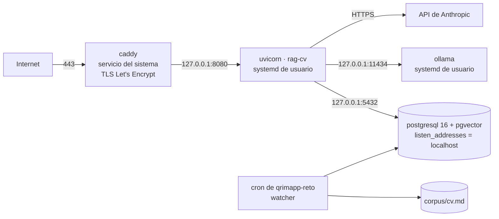

# RFC-0020 — Topología nativa de QA y despliegue por SSH

| Campo | Valor |
| :--- | :--- |
| **Estado** | Aprobado |
| **Depende de** | RFC-0016, RFC-0007, RFC-0008, RFC-0017, RFC-0019 |
| **Supersede** | RFC-0007 §5.1 y §5.3 (topología y despliegue de QA) y RFC-0015 §7 (composición de QA), para el alcance de la PoC |
| **ADRs** | ADR-0010 |
| **Fecha** | 2026-08-22 |

---

## 1. Contexto y problema

ADR-0010 decidió desplegar QA de forma nativa, sin contenedores. Este RFC es el contrato de esa
topología y del despliegue por SSH.

Lo que **no** cambia, y es la mayor parte del sistema: la aplicación, su arquitectura, el troceado
(RFC-0002), la recuperación híbrida (RFC-0003), la capa de agente (RFC-0004), la API y su
autenticación (RFC-0005), el esquema (RFC-0006), la evaluación (RFC-0009) y la disciplina TDD
(RFC-0014). **Cambia dónde corren los procesos y cómo llega el código, nada más.** Que el cambio
se pueda acotar así es consecuencia de que la configuración ya fuera externa (RNF-13).

Lo que sí desaparece es la propiedad que el contenedor daba: el artefacto portátil. Se sustituye,
no se ignora — §6.

## 2. Alcance

**Entra:** la topología de procesos, el aprovisionamiento con privilegios, la supervisión, el
aislamiento de red, el despliegue por SSH con identidad de release y reversión, y la configuración
que cambia respecto al diseño con contenedores.

**No entra:** el modelo de embeddings (RFC-0017), el proveedor de generación (RFC-0018), el sondeo
del corpus (RFC-0019), el diseño de empaquetado en contenedor (RFC-0015, diferido con PROD).

## 3. Topología



| Proceso | Cómo corre | Quién lo gestiona | Escucha en |
| :--- | :--- | :--- | :--- |
| `caddy` | Servicio del sistema (`systemd`) | `root`, aprovisionamiento | `0.0.0.0:80`, `0.0.0.0:443` |
| `postgresql` | Servicio del sistema (`systemd`) | `root`, aprovisionamiento | `127.0.0.1:5432` |
| `rag-cv` (uvicorn) | **Unidad de usuario** de `systemd` | `qrimapp-reto` | `127.0.0.1:8080` |
| `ollama` | **Unidad de usuario** de `systemd` | `qrimapp-reto` | `127.0.0.1:11434` |
| `watcher` | `crontab` de `qrimapp-reto` (RFC-0019) | `qrimapp-reto` | — |

La división no es arbitraria: **lo que el operador necesita reiniciar en el día a día corre como
unidad de usuario**; lo que solo se toca al aprovisionar corre como servicio del sistema. Es la
misma separación por momento y no por persona que fija RFC-0016 §8.1, aplicada a los procesos.

## 4. Aprovisionamiento — una vez por VPS, con privilegios

```bash
# 1. Paquetes del sistema
apt-get install -y postgresql-16 postgresql-16-pgvector caddy python3.12-venv

# 2. Base de datos: solo por bucle local
#    postgresql.conf -> listen_addresses = 'localhost'

# 3. Cortafuegos: solo SSH y HTTP/S (RFC-0007 §5.1, sin cambios)
ufw allow 22,80,443/tcp && ufw enable

# 4. Ollama nativo
curl -fsSL https://ollama.com/install.sh | sh
systemctl disable --now ollama      # ver la nota siguiente

# 5. Que las unidades de usuario arranquen sin sesión abierta
loginctl enable-linger qrimapp-reto

# 6. Árbol de despliegue, propiedad del operador
install -d -o qrimapp-reto -g qrimapp-reto /home/qrimapp-reto/rag-cv/{releases,corpus,logs}
```

**El paso 4 tiene una trampa que hay que decir.** El instalador oficial de Ollama crea y arranca
una **unidad del sistema**. Si se deja activa y además se define la unidad de usuario de §5, hay
dos instancias compitiendo por el 11434: la segunda falla al arrancar y el síntoma —`/readyz` en
rojo por un embedder que "no responde"— no apunta a la causa. Se deshabilita la del sistema y se
gestiona una sola, la de usuario, que es la que el operador puede reiniciar sin `sudo`.

**`enable-linger` es lo que hace que esto sobreviva a un reinicio.** Sin él, las unidades de
usuario mueren al cerrar la sesión SSH y no arrancan al iniciar el host: el VPS se reinicia de
madrugada y por la mañana no hay servicio, sin ningún error que lo explique.

## 5. Supervisión

Dos unidades de usuario en `~/.config/systemd/user/`, con `Restart=always` y `WantedBy=default.target`:

| Unidad | Ejecuta | Depende de |
| :--- | :--- | :--- |
| `rag-cv-api.service` | `$RAG_CV_HOME/current/.venv/bin/uvicorn` sobre `127.0.0.1:8080`, 2 *workers* | `rag-cv-ollama.service` |
| `rag-cv-ollama.service` | `ollama serve` con `OLLAMA_HOST=127.0.0.1:11434` | — |

El operador gestiona con `systemctl --user restart rag-cv-api` y diagnostica con
`journalctl --user -u rag-cv-api`. **Nada de eso requiere `sudo`**, que es el objetivo de
RFC-0016 §8.1.

**Límites de recurso.** Sin contenedor no hay límites por servicio de forma implícita, y en un
host de 2 núcleos eso importa (RFC-0016 §5). Se fijan explícitamente en las unidades con
`MemoryMax` y `CPUWeight`, de modo que una indexación desbocada degrade su propio servicio antes
que tumbar PostgreSQL o la API. Los valores se ajustan con la medición de RFC-0016 CA-4.

## 6. Despliegue por SSH e identidad de release

El artefacto deja de ser una imagen con *digest* y pasa a ser **un commit**. Para que eso
signifique algo verificable, el despliegue es por directorios inmutables con conmutación por
enlace simbólico:

```bash
# desde el CI o desde DEV, con SHA = commit validado en verde
rsync -a --delete --exclude='.env' --exclude='.git' --exclude='corpus/' \
      ./ qrimapp-reto@vps:$RAG_CV_HOME/releases/$SHA/
ssh qrimapp-reto@vps bash -se <<'EOS'
  set -euo pipefail
  cd "$RAG_CV_HOME/releases/$SHA"
  python3.12 -m venv .venv && .venv/bin/pip install -r requirements.lock
  .venv/bin/alembic upgrade head
  ln -sfn "$RAG_CV_HOME/releases/$SHA" "$RAG_CV_HOME/current.new"
  mv -Tf "$RAG_CV_HOME/current.new" "$RAG_CV_HOME/current"
  systemctl --user restart rag-cv-api
EOS
curl -fsS https://qa.<dominio>/readyz
```

**Las exclusiones del `rsync` no son higiene, son seguridad.** Sin ellas, un `.env` de desarrollo
viajaría al servidor dentro del árbol de la release y podría cargarse en lugar del `.env` del
host, metiendo credenciales locales en QA sin que nada lo señale. `.dockerignore` cumplía esta
función en el diseño con contenedores (RFC-0015 §5) y aquí no existe. Y `corpus/` se excluye
porque el corpus **vive en el VPS y no en el repositorio** (RFC-0016 §3.3): sincronizarlo lo
pisaría con lo que hubiera en la máquina de despliegue.

Tres propiedades que esto conserva del diseño con contenedores:

1. **Conmutación atómica.** `mv -Tf` sobre un enlace simbólico es atómico: no existe un instante
   en el que `current` apunte a medias. Es el equivalente al reemplazo atómico que RFC-0019 §4
   exige para el corpus, aplicado al código.
2. **Reversión inmediata.** Volver a la release anterior es repetir la conmutación apuntando a su
   directorio y reiniciar. No hay reconstrucción de por medio.
3. **Identidad verificable.** La aplicación **expone el SHA desplegado** en la respuesta de
   `/readyz`. Sin eso, "desplegamos el commit X" es una afirmación de la persona que desplegó, no
   un hecho comprobable — y ahí es donde el sustituto de RNF-10 se rompería en silencio.

**Se declara la diferencia, sin adornarla:** el SHA garantiza *qué código* corre, no *con qué
dependencias del sistema*. La versión de PostgreSQL, de pgvector, de Python y de Ollama son estado
del host. `requirements.lock` fija las de Python; el resto vive en el procedimiento de §4, y un
procedimiento se desactualiza. Es la deuda que ADR-0010 aceptó.

## 7. Aislamiento de red

RNF-7 —la base de datos nunca se expone a internet— se cumple sin la red del compose:

| Servicio | Mecanismo |
| :--- | :--- |
| PostgreSQL | `listen_addresses = 'localhost'` + `ufw` sin el 5432 |
| Ollama | `OLLAMA_HOST=127.0.0.1:11434`; nunca `0.0.0.0` |
| API | `uvicorn` sobre `127.0.0.1:8080`; solo Caddy la alcanza |
| Caddy | Único proceso con puertos públicos, junto a SSH |

**Ollama escuchando en `0.0.0.0` es el fallo grave de esta topología.** Un servicio de inferencia
abierto a internet sin autenticación es capacidad de cómputo ajena corriendo en tu VPS, y el
cambio es una variable de entorno. Por eso tiene comprobación propia (CA-4) y severidad
Bloqueante.

## 8. Configuración que cambia

| Variable | Con contenedores | Nativo |
| :--- | :--- | :--- |
| `OLLAMA_BASE_URL` | `http://ollama:11434` | `http://127.0.0.1:11434` |
| `DATABASE_URL` (anfitrión) | `db` | `127.0.0.1` |
| `CORPUS_PATH` | ruta montada | `$RAG_CV_HOME/corpus/cv.md` |

El resto de RFC-0016 §7 no cambia: los nombres de servicio del compose eran lo único que dependía
de la existencia del compose.

## 9. Fallos y degradación

| Fallo | Detección | Comportamiento |
| :--- | :--- | :--- |
| La API muere | `Restart=always` | `systemd` la reinicia; si entra en bucle, `journalctl` lo muestra y `/readyz` queda en rojo |
| El VPS se reinicia sin `enable-linger` | Ausencia de servicio tras el arranque | **No hay servicio y no hay error.** Lo previene §4 paso 5 y lo verifica CA-2 |
| Dos instancias de Ollama por la unidad del sistema | La segunda no arranca | `/readyz` en rojo por embedder ausente. Lo previene §4 paso 4 y lo verifica CA-3 |
| Migración fallida a mitad del despliegue | `alembic` devuelve error | El enlace `current` **no se conmuta**: sigue corriendo la release anterior |
| Una release nueva arranca mal | `/readyz` tras el despliegue | Reversión conmutando el enlace (§6) |
| Un proceso consume toda la memoria | `MemoryMax` de la unidad | `systemd` lo detiene antes de que el host entre en OOM |
| Deriva de dependencias del sistema | — | **Sin detección automática.** Es la deuda declarada de ADR-0010 |

## 10. Criterios de aceptación

| # | Criterio | Verificación |
| :--- | :--- | :--- |
| CA-1 | Ningún proceso de la aplicación corre como `root` ni requiere `sudo` para operar | `ps -o user= -p` sobre los procesos + ciclo completo con la cuenta de operación |
| CA-2 | Tras `reboot`, el servicio vuelve solo, sin sesión SSH abierta | Reinicio del VPS + `curl /readyz` |
| CA-3 | Existe **una sola** instancia de Ollama y es la unidad de usuario | `systemctl list-units 'ollama*'` + `ss -ltnp` |
| CA-4 | Ni PostgreSQL ni Ollama escuchan fuera de `127.0.0.1` | `ss -ltnp` y sondeo desde fuera del host |
| CA-5 | `/readyz` expone el SHA de commit desplegado y coincide con el enlace `current` | `curl /readyz` + `readlink $RAG_CV_HOME/current` |
| CA-6 | Una migración fallida deja corriendo la release anterior | Despliegue con una migración rota a propósito |
| CA-7 | La reversión a la release anterior se completa sin reconstruir nada | Conmutar el enlace + `curl /readyz` |
| CA-8 | Las unidades declaran `MemoryMax` y el host no entra en OOM durante una indexación completa | `systemctl --user show -p MemoryMax` + RFC-0016 CA-4 |
| CA-9 | El procedimiento de §4 reconstruye un VPS vacío hasta `/readyz` en verde | Ejecución sobre un host limpio |
| CA-10 | El despliegue no transporta `.env` ni sobrescribe el corpus del VPS | Desplegar con un `.env` presente en el origen y comprobar que no llega, y que `corpus/cv.md` no cambia |

## 11. Riesgos

| Riesgo | Mitigación |
| :--- | :--- |
| **Ollama expuesto en `0.0.0.0`** | §7 + CA-4, severidad Bloqueante |
| Sin `enable-linger`, un reinicio deja el VPS sin servicio y sin error | §4 paso 5 + CA-2 |
| Dos instancias de Ollama con un síntoma que no apunta a la causa | §4 paso 4 + CA-3 |
| "Desplegamos el commit X" sin forma de comprobarlo | CA-5: el SHA se expone en `/readyz` |
| Deriva de dependencias del sistema; el procedimiento de §4 envejece | CA-9 lo ejercita sobre un host limpio, que es lo único que detecta la deriva |
| Sin aislamiento, un proceso desbocado tumba a los demás | `MemoryMax` y `CPUWeight` por unidad (§5, CA-8) |
| Los directorios de releases llenan el disco | Retención acotada en el procedimiento de despliegue, junto a la rotación de bitácoras de RFC-0019 §7 |
| Un `.env` de desarrollo viaja al servidor con el `rsync` | Exclusiones explícitas en §6 + CA-10, severidad Bloqueante |
| El despliegue pisa el corpus del VPS con el de la máquina de origen | `corpus/` excluido en §6 + CA-10 |

## Contrato de auditoría (gate ADU)

| # | Comprobación | Cómo se verifica | Severidad si falla |
| :--- | :--- | :--- | :--- |
| A-1 | Ollama y PostgreSQL solo escuchan en `127.0.0.1` | CA-4 | **Bloqueante** |
| A-2 | Ningún proceso de la aplicación corre como `root` | CA-1 | Bloqueante |
| A-3 | `/readyz` expone el SHA desplegado y coincide con `current` | CA-5 | Bloqueante |
| A-4 | Una migración fallida no conmuta el enlace de release | CA-6 | Bloqueante |
| A-5 | El servicio vuelve solo tras un reinicio del host | CA-2 | Bloqueante |
| A-6 | Existe una sola instancia de Ollama | CA-3 | Mayor |
| A-7 | La operación diaria no necesita `sudo` en ninguna automatización | CA-1 | Mayor |
| A-8 | Las unidades declaran límites de memoria | CA-8 | Mayor |
| A-9 | El procedimiento de aprovisionamiento reconstruye un host vacío | CA-9 | Mayor |
| A-10 | RFC-0015 no ha sido editado: sigue siendo el diseño de empaquetado diferido | `git diff` sobre RFC-0015 | Bloqueante |
| A-11 | La sincronización excluye `.env` y `corpus/` | CA-10 | **Bloqueante** |
| A-12 | Existe retención acotada de releases antiguas | Lectura del procedimiento | Menor |
